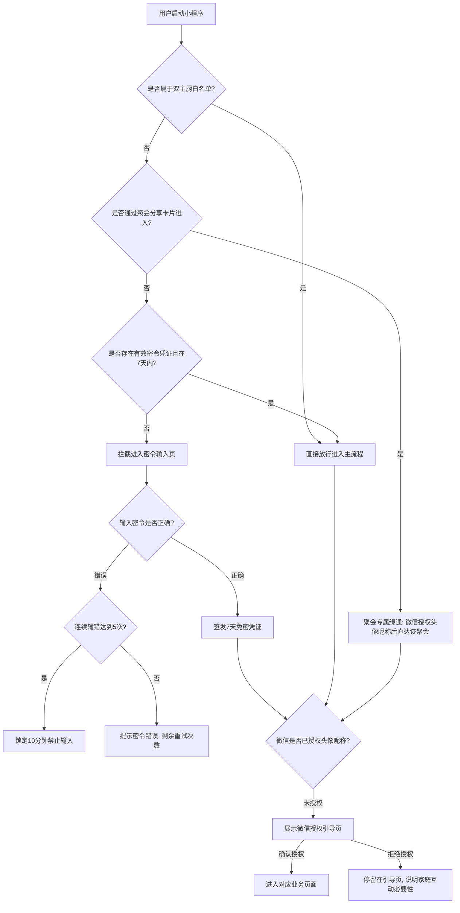
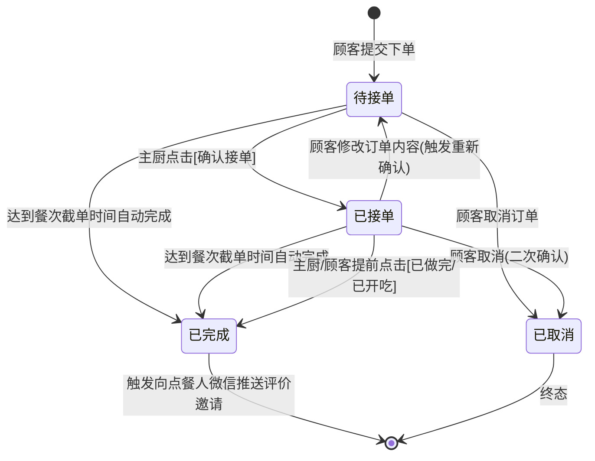

# 我们的餐桌 · 微信小程序功能需求说明书 (FRS)

| 项目 | 内容 |
| --- | --- |
| 产品名称 | 我们的餐桌 |
| 产品形态 | 微信小程序（原生开发） |
| 文档版本 | v1.1 |
| 文档状态 | 待评审 |
| 编写日期 | 2026-09-05 |
| 文档定位 | 纯功能需求说明书（FRS），面向产品、设计、前端开发与测试团队；底层数据库设计、接口协议定义、Redis 键结构与部署架构将在独立的《技术设计文档》中编写 |
| 依据材料 | 《原始构思.docx》、UI 设计稿（《小程序UI总览.png》）、参考小程序 UI（喜茶 GO、混果汁） |

### 修订记录

| 版本 | 日期 | 修订人 | 说明 |
| --- | --- | --- | --- |
| v1.0 | 2026-09-02 | — | 基于《原始构思.docx》与 UI 设计稿整理初稿，梳理基础模块与大致流程 |
| v1.1 | 2026-09-05 | 产品组 | 依据《原始构思.docx》手写草稿与 UI 总览图进行全面功能深化：<br>1. 明确双餐厅对等模型与双主厨身份绑定、自选掌勺记录模式；<br>2. 补充聚会外发邀请的免密绿通与准入密令后台管理；<br>3. 细化点餐页规格抽屉、已选清单悬浮展开与多人协同防冲突；<br>4. 确立“定时自动完成 + 主厨/点餐人手动提前完成”的双轨流转机制；<br>5. 完善聚会采购清单的主动认领与人均费用动态核算；<br>6. 细化主厨工作台“查看做法”大字号展示与 10 大节日换肤自动化规则；<br>7. 严格剥离底层技术实现细节，仅保留功能性业务规则与验收标准。 |

---

## 1. 阅读指引

### 1.1 需求编号规则

全文功能需求均带唯一编号，格式为 `FR-<模块>-<序号>`，便于后续设计审查、开发任务排期与测试用例双向追溯。

| 模块前缀 | 含义 | 覆盖核心功能 |
| --- | --- | --- |
| `FR-AUTH` | 准入控制与身份体系 | 白名单免密、7 天密令凭证、微信授权、聚会绿通、密令重设 |
| `FR-HOME` | 首页 | 时段动态问候、做饭统计（周/月/年）、折线趋势图、今日时令推荐 |
| `FR-ORD` | 点餐系统 | 餐厅选择与切换、餐次 Tab、规格抽屉、已选清单浮层、多人协同、下单确认 |
| `FR-BILL` | 订单管理 | 订单状态机、手动提前完成、定时自动完成、追加/修改/取消、菜品多维度评价 |
| `FR-PARTY` | 聚会系统 | 聚会创建、微信分享卡片、成员报名、采购清单协同与认领、人均费用分摊、历史归档 |
| `FR-ME` | 个人中心 | 用户名片、当前订单置顶卡片、功能入口（历史订单/我的评价/聚会记录）、主厨入口 |
| `FR-ADM` | 主厨后台管理 | 今日工作台、查看做法、一键接单、餐厅封面与名称、品类管理、菜品与季节限定、规格引擎、密令维护 |
| `FR-MSG` | 微信消息推送 | 7 大订阅消息场景矩阵（下单、变更、接单、自动/手动完成、评价邀请、聚会邀请） |
| `FR-UI` | 视觉与交互规范 | 喜茶/混果汁设计语言、10 大节日主题自动换肤、机型自适应、组件通用交互 |
| `FR-DATA`| 业务数据完整性 | 历史订单菜品与规格快照、下架菜品评价留存、采购账单归档锁定 |

优先级采用 MoSCoW 简化标记：`P0` 必须有（首期核心闭环，不可或缺），`P1` 应该有（首期重要增强），`P2` 可以有（体验优化，可灵活排期）。

### 1.2 术语表

| 术语 | 定义与业务边界 |
| --- | --- |
| 主厨 | 某一餐厅的所有者与出品方。拥有该餐厅后台管理的专属权限，负责菜品研发维护、接单、查阅做法备注、出品 |
| 顾客 | 在某一餐厅浏览菜单并下单点餐的一方。同一自然人在对方餐厅中即为顾客 |
| 餐厅 | 系统内的双实体主体（如“我的厨房”与“她的餐厅”）。每位主厨名下拥有且仅拥有一家专属餐厅 |
| 双餐厅对等模型 | 系统内固定存在两家对等餐厅，双方互为主厨与顾客。支持“向对方点餐”与“自己掌勺自建备忘”双重场景 |
| 餐次 | 一天中的用餐时段，系统划分为四个离散枚举：早餐、午餐、晚餐、宵夜 |
| 订单 | 同一餐厅 + 同一自然日 + 同一餐次下的唯一共享单据。若已有进行中订单，新点菜品自动并入而非新建 |
| 订单项 | 订单中的一道具体菜品记录，含菜品名、所选规格标签、数量、点餐人（如“我点的”、“她点的”） |
| 密令 | 非白名单访客首次进入小程序所需的通行口令，输入正确后签发有效期为 7 天的免密访问凭证 |
| 聚会绿通 | 亲友通过聚会微信分享卡片进入时的受限免密通道，仅需微信授权即可加入该聚会协作，无权访问日常餐厅 |
| 季节限定 | 系统常驻的内置菜单品类，其下菜品绑定 1~12 月生效月份，点餐页严格按当前自然月动态判定显示 |
| 做法备注 | 主厨为菜品录入的独家私房烹饪秘籍与配料比例，仅在主厨接单与做菜视角展示，顾客端绝对不可见 |
| 采购清单 | 聚会活动下的物品协作采购清单，支持物品明细、成员认领、状态转换、实际金额录入与人均动态平摊 |

---

## 2. 产品概述

### 2.1 背景与产品定位

“我们的餐桌”面向情侣或小家庭这一私密亲密关系圈，将“今天谁做饭、吃什么”的日常琐事，重塑为“两个人各自经营一家家庭餐厅、互相点餐与制作”的轻量仪式感产品。

本产品为**非商业化**的家庭情感记录与协同工具，**不涉及在线支付、外部资金结算、外卖配送与营销推广**。产品的核心价值在于：
1. **结构化呈现**：让家庭烹饪、口味偏好、时令饮食有迹可循；
2. **仪式感互动**：通过点餐通知、主厨专属接单、查看做法、用餐评价等闭环交互，增进双方生活情趣；
3. **多人线下聚餐轻协同**：提供节日家宴、亲友聚会的轻量邀请、物品分工认领与人均花费清晰统计。

### 2.2 核心设计理念：双餐厅对等模型与绑定机制

这是贯穿全系统的核心骨架：

```mermaid
graph LR
    subgraph 用户A（我）
        A1[我是：我的厨房 · 主厨]
        A2[我是：她的餐厅 · 顾客]
    end
    subgraph 用户B（她）
        B1[我是：她的餐厅 · 主厨]
        B2[我是：我的厨房 · 顾客]
    end
    A1 -.管理菜单/接单/看做法.-> R1[(我的厨房)]
    B2 -.点餐/加减菜/评价.-> R1
    B1 -.管理菜单/接单/看做法.-> R2[(她的餐厅)]
    A2 -.点餐/加减菜/评价.-> R2
```

1. **实体对等绑定**：
   - 系统固定维护两家餐厅实体（如“我的厨房”和“她的餐厅”），在系统初始化或后台配置中分别与双方的微信唯一标识（OpenID）绑定。
   - 用户登录后，系统自动判定当前身份：
     - 若访问自有餐厅，身份为主厨，享有后台管理、菜品上下架、查阅私房做法备注、确认接单权限；
     - 若访问对方餐厅，身份为顾客，享有浏览菜单、选择规格、加减菜品、提交订单、评价菜品权限。
2. **双向点餐模式支持**：
   - **模式一：向对方点餐**（情侣点餐日常）。A 进入“她的餐厅”，选菜下单，B 收到提醒并掌勺制作。
   - **模式二：掌勺自选记录**（自我掌勺备忘）。今天由 A 主动下厨，A 进入“我的厨房”选定菜品并下单，此订单既作为今日开伙记录，B 也可在该订单中查看或追加菜品。
3. **隔离与归属原则**：
   - **订单归属唯一**：每张订单必须严格绑定归属到唯一餐厅，接单与出品主体始终是该餐厅的主厨。
   - **统计严格隔离**：做饭次数、拿手菜排行、菜品评分均按餐厅主体隔离聚合，互不混淆。

### 2.3 目标用户与角色权限划分

| 角色 | 定义与适用人群 | 典型行为 |
| --- | --- | --- |
| 自有餐厅主厨 | 当前操作餐厅的拥有者（我或伴侣） | 维护餐厅名称与封面、管理菜单品类、录入/编辑菜品及私房做法、接单、查阅烹饪步骤、提前点击制作完成 |
| 对方餐厅顾客 | 在当前餐厅浏览下单的伴侣或家庭成员 | 浏览菜单、自选规格、共同加菜减菜、提交订单、修改/追加/取消订单、用餐后打星与写评价 |
| 聚会受邀亲友 | 通过微信分享卡片进入聚会的亲友、长辈 | 查阅聚会时间地点、一键报名、在采购清单中主动认领物品或被指定购买、录入实际花费金额、查阅人均分摊 |
| 普通访客 | 未在白名单且未通过聚会绿通进入的微信用户 | 被拦截在密令输入页，必须输入有效密令后方可解锁 7 天访问权限 |

### 2.4 典型使用场景走查

- **场景一：下班前的点餐互动（日常双餐厅）**
  傍晚 17:30，男生小杰下班路上打开小程序。首页根据时间展示温暖问候语“辛苦了一天，今晚想吃什么？”，并提示“本周已做饭 4 次”。小杰点击底部“点餐”，选择“她的餐厅”，系统默认定位到“晚餐”Tab。小杰在热菜中找到番茄牛腩，点击“+”弹出规格抽屉，勾选“微辣”并加入订单；随后又点了清蒸鲈鱼。此时底部浮现出“已选 2 道菜 · 1 人 >”。小杰将点餐车告知女生小敏，小敏打开同一餐厅同一晚餐，看到小杰已选的菜品，自己又加了一道蒜蓉西兰花。小杰确认用餐人数为 2 人，备注“少油少盐，汤汁多一点”，点击提交。小敏微信立即收到微信订阅提醒“您的餐厅有新订单：今晚晚餐共 3 道菜”。小敏在主厨管理页点击“查看做法”重温调料配比，点击“确认接单”。
- **场景二：家宴聚会组织与采购分摊（周末聚会）**
  中秋节前夕，小敏在小程序“聚会”Tab 创建了“中秋家宴”，设定时间为 9 月 17 日 17:00—22:00，地点为“家里”，随后将生成的微信分享卡片发至家庭微信群。公公、婆婆、弟弟点击卡片直接进入聚会页一键报名（无需输入日常点餐密令）。成员在采购清单中协同：小杰负责大闸蟹，婆婆认领葡萄，弟弟认领饮料。买完后各人在对应物品上点击“已购买”并录入金额，页面右下角即时算出“人均 ¥42”。聚会结束后，账单完整封存进历史聚会记录。

---

## 3. 需求范围

### 3.1 本期交付范围

1. **准入与授权**：双主厨白名单自动识别、访客密令校验（7 天有效期）、聚会微信分享绿通、主厨后台密令管理；
2. **首页仪式感与统计**：时段智能问候、周/月/年做饭统计看板、做饭趋势折线图、今日时令菜轮播与跨餐厅加购；
3. **点餐体系**：双餐厅展示与快速切换、四餐次智能定位与预选、品类菜品联动、规格选择抽屉、已选清单展开浮层、多人协同点餐防冲突、防重复下单；
4. **订单全流程**：进行中与已完成双 Tab 视图、订单详情与点餐人标注、追加/修改/取消全链路、定时自动完成与主厨/顾客提前手动完成双轨机制、菜品 1~5 星与文字评价体系；
5. **聚会与采购分摊**：聚会创建与微信卡片分享、亲友一键报名、采购清单表格协作、物品认领、状态转换、实际金额录入、人均费用动态核算、历史聚会归档；
6. **个人中心**：用户信息名片、进行中订单置顶卡片、历史订单/评价/聚会聚合入口、主厨专属入口；
7. **主厨后台管理**：今日待办工作台、每道菜“查看做法”大字号浮层、一键接单、餐厅封面与资料设置、品类生命周期（内置季节限定锁定保护）、菜品上下架与季节供应月份配置、自定义规格引擎；
8. **微信消息推送**：顾客下单、菜品变更、主厨接单、用餐完成评价提醒、聚会邀请等关键链路的微信订阅消息推送；
9. **全局体验与节日换肤**：喜茶/混果汁视觉语言、中国 10 大传统节假日主题自动无缝切换、多机型安全区与自适应。

### 3.2 明确不在本期交付范围

1. **在线资金收付与线上结算**：聚会仅提供消费金额登记与人均算账，不引入微信支付或转账结算能力；
2. **外卖与地图导航**：不提供商用外卖打包费、配送距离计算与地图路线导航；
3. **多于两家餐厅的平台化扩展**：系统严格聚焦于两人双餐厅模型，不支持开放式多店入住；
4. **菜品热量与营养成分精算**：不引入繁重的卡路里数据库；
5. **公共社交广场与朋友圈**：非公开社交产品，不提供公开信息流与评论互动。

---

## 4. 角色与权限体系

### 4.1 准入控制（两道门 + 聚会绿通机制）

系统采用分层准入控制，兼顾私密安全性与亲友聚会分享的便利性：



| 需求编号 | 需求描述 | 业务规则与异常边界 | 优先级 |
| --- | --- | --- | --- |
| `FR-AUTH-01` | 白名单永久放行机制 | 系统在配置中录入双方（我与伴侣）的微信唯一标识。白名单用户启动小程序直接放行，永不弹出密令页 | P0 |
| `FR-AUTH-02` | 密令准入机制 | 非白名单用户首次访问，强制拦截在密令输入页，必须输入正确密令方可继续 | P0 |
| `FR-AUTH-03` | 7 天免密凭证签发 | 密令校验成功后，系统记录该访客凭证，有效期为自通过之时起 7 个自然日（7×24小时）。有效期内再次打开小程序免密进入；过期后重新拦截至密令页 | P0 |
| `FR-AUTH-04` | 输错防暴力破解 | 密令输入页支持即时判空与错误提示。若同一用户连续输错达到 5 次，系统自动锁定 10 分钟，期间禁用输入框与提交按钮，倒计时结束后方可重新尝试 | P1 |
| `FR-AUTH-05` | 聚会专属免密绿通 | 亲友通过微信聊天或微信群点击聚会专属分享链接时，系统识别携带的聚会邀请标识，自动绕过日常密令校验，允许亲友直接进入授权引导页；授权后仅开放该聚会详情与采购清单，无法访问日常餐厅、点餐与主厨后台 | P0 |
| `FR-AUTH-06` | 微信授权登录 | 用户通过准入校验后，需唤起微信原生授权获取头像与昵称。头像与昵称用于点餐人标注、订单参与者列表与聚会成员展示 | P0 |
| `FR-AUTH-07` | 拒绝授权友好引导 | 用户若点击拒绝授权，界面平滑停留在引导页，展示温和文案（“授权微信头像与昵称，才能在餐桌上看到是谁点的菜哦”），并提供“重新授权”大按钮，不可直接进入主界面 | P1 |
| `FR-AUTH-08` | 主厨后台密令管理 | 准入密令支持在主厨后台由主厨随时查看、一键生成随机密令或自定义修改。修改后，此前已签发且在 7 天有效期内的访客凭证保持有效直到自然过期，不强制踢出当前会话 | P1 |

### 4.2 细粒度功能权限矩阵

标记说明：`√` 允许访问；`—` 界面隐藏且服务端拒绝访问；`限定` 受业务范围限定。

| 功能模块 | 自有餐厅主厨 | 对方餐厅顾客 | 聚会受邀成员 | 未过密令访客 |
| --- | --- | --- | --- | --- |
| 密令输入页 | √（仅登出/测试时） | √（仅登出/测试时） | —（聚会绿通免密） | √（强制展示） |
| 首页（问候、统计、时令） | √ | √ | — | — |
| 浏览对方餐厅菜单并下单 | — | √ | — | — |
| 浏览自有餐厅菜单并点餐 | √（自选备忘模式） | — | — | — |
| 点餐过程加减菜品/选规格 | √（限自有单） | √（限对方单） | — | — |
| 查看订单详情 | √（本餐厅订单） | √（本人参与订单） | — | — |
| 追加菜品 / 修改 / 取消订单 | — | √（本人参与进行中订单）| — | — |
| 提前手动完成订单 | √（出品方主厨） | √（点餐发起方） | — | — |
| 查阅菜品【做法】烹饪备注 | **√（仅本餐厅主厨）** | **—（严密隐藏）** | — | — |
| 确认接单操作 | √（本餐厅主厨） | — | — | — |
| 菜品星级与文字评价 | — | √（订单参与者） | — | — |
| 创建聚会 / 发送微信邀请 | √ | √ | — | — |
| 聚会报名 / 退出报名 | √ | √ | √ | — |
| 采购清单新增物品 / 认领 / 填金额 | √ | √ | √ | — |
| 个人中心主厨管理入口卡片 | **√（主厨可见）** | **—（隐藏）** | — | — |
| 餐厅设置 / 品类 / 菜品增删改 | √（仅限自有餐厅） | — | — | — |
| 密令查看与重置 | √（主厨权限） | — | — | — |

---

## 5. 全局视觉与交互规范

### 5.1 设计风格与版式规范

对照参考小程序【喜茶 GO】与【混果汁】，本产品确立以下交互设计基调：

| 需求编号 | 需求描述 | 界面交互与规则要点 | 优先级 |
| --- | --- | --- | --- |
| `FR-UI-01` | 喜茶/混果汁视觉语言 | 采用**大图留白、克制字重对比、弱化硬分割线、以高质量食物大图为视觉主体**的现代排版风格。避免杂乱线条，通过背景底色色块区分功能区域 | P0 |
| `FR-UI-02` | 私密温暖品牌主色 | 主色沿用设计稿的**墨绿（森林绿，突出天然健康）**搭配**温暖米白（柔和底色，营造家庭温馨）**，点缀色采用暖橙与砖红（用于【HOT】角标、爱心收藏、待处理提示） | P0 |
| `FR-UI-03` | 五大主 Tab 导航 | 底部固定五个系统一级 Tab：**首页、点餐、订单、聚会、我的**。当前激活态 Tab 表现为实心图标填充 + 主色文字变色，未激活态为浅灰描边图标 | P0 |
| `FR-UI-04` | 全机型与安全区自适应 | 全局页面强制自适应不同比例屏幕（如 iPhone X/14/15/16 等刘海屏与灵动岛机型，以及折叠屏、标准 16:9 机型）。严格预留底部安全区（Safe Area），保证悬浮结算栏与底部操作按钮不被虚拟按键或小白条遮挡 | P0 |

### 5.2 节日主题装饰自动化机制

结合《原始构思.docx》手写要求，小程序预留主题挂饰元素位，在临近中国传统节日与法定假日时自动呈现节日氛围，节后自动恢复。

```mermaid
timeline
    title 节日主题时间轴示例（以中秋节为例）
    中秋前3天 : 自动换肤进入节日主题 : 首页挂上中秋灯笼/桂花插画 : 聚会卡片换上家宴赏月插图
    节日当天 : 保持节日主题高亮
    节后次日 00:00 : 自动卸除节日装饰 : 恢复日常温暖米白默认主题
```

| 需求编号 | 需求描述 | 业务规则与边界约束 | 优先级 |
| --- | --- | --- | --- |
| `FR-UI-05` | 预留换肤元素位 | 在小程序首页右上角、页面页头背景、聚会卡片头部固定预留装饰素材挂载位，主题替换时不挤压核心业务操作区域 | P0 |
| `FR-UI-06` | 覆盖 10 大法定与传统节日 | 自动换肤规则覆盖以下 10 个重要节日：**除夕、春节、元宵节、清明节、劳动节（5·1）、端午节、七夕节、中秋节、国庆节、冬至节** | P1 |
| `FR-UI-07` | 节日周期与生效规则 | **默认提前 3 天进入节日主题，节日当日结束后次日 00:00 自动恢复默认主题**。农历节日的公历日期由系统配置表维护（支持按年份预设） | P1 |
| `FR-UI-08` | 节日重叠与冲突优先级 | 当两个节日的提前生效周期发生重叠时，按照优先级更高者呈现：**除夕 > 春节 > 元宵节**；七夕 > 默认；中秋 > 国庆（若中秋国庆同档则使用中秋国庆双节专属主题） | P1 |
| `FR-UI-09` | 装饰素材优雅降级 | 当本地无对应节日素材或网络加载素材异常时，界面静默降级为默认主题渲染，禁止阻断主流程或出现破损图片 | P0 |

### 5.3 通用交互与状态规范

| 需求编号 | 需求描述 | 界面交互与规则要点 | 优先级 |
| --- | --- | --- | --- |
| `FR-UI-10` | 动效与触控反馈 | 步进器点击、Tab 切换、弹窗升起均配备 150~250ms 的流畅平滑过渡动效；按钮触按具备轻微缩放或透明度变化即时视觉反馈 | P1 |
| `FR-UI-11` | 标准空态（Empty State） | 所有列表类页面（无订单、无菜品、无聚会、无评价）均需配备温馨手绘插画、家庭化文案及明确的操作行动指引按钮（如订单为空时显示“厨房还热乎着，去点道菜吧”及[去点餐]按钮） | P0 |
| `FR-UI-12` | 加载与异常容错 | 页面初始加载使用微光骨架屏（Skeleton）；网络请求失败时弹出可点击重试的操作条；禁止任何白屏或无反馈假死 | P0 |
| `FR-UI-13` | 破坏性操作二次确认 | 关键破坏性操作（**取消订单、删除菜品、删除品类、移除采购项**）必须唤起居中模态二次确认弹窗，并明确告知后果（如“删除后历史订单记录仍保留，但顾客将无法再点这道菜”） | P0 |
| `FR-UI-14` | 图片裁切与占位保障 | 菜品上传与封面上传均提供原生前端比例裁切工具；图片加载过程中展示淡灰色带有餐盘轮廓的占位背景，防止布局错位跳变 | P0 |
| `FR-UI-15` | 家庭化第一人称文案规范 | 文案全量杜绝“商户”、“收单”、“交易流水”、“SKU”等生硬商业用词；统一采用“我的厨房”、“她的餐厅”、“今天想吃什么”、“私房做法”、“人均分摊”等亲切家庭语言 | P1 |

---

## 6. 功能需求细则

### 6.1 首页 (`FR-HOME`)

作为小程序启动后的默认落地页，首页承担“生活仪式感呈现 + 饮食数据回顾 + 今日吃啥推荐”的核心职能。

#### 6.1.1 时段问候与做饭统计

| 需求编号 | 需求描述 | 界面要素与详细业务逻辑 | 优先级 |
| --- | --- | --- | --- |
| `FR-HOME-01` | 时段智能家庭问候语 | 位于首页页头，根据用户打开小程序时的自然时间，动态渲染温暖问候语与生活插图：<br>- **早餐时段（05:00-10:29）**：“早安！今天早餐吃点什么好呢？”<br>- **午餐时段（10:30-14:29）**：“中午好！再忙也要好好吃饭哦”<br>- **晚餐时段（14:30-20:59）**：“辛苦了一天，今晚想吃什么？”<br>- **宵夜时段（21:00-次日04:59）**：“夜深了，来点暖胃宵夜吗？” | P1 |
| `FR-HOME-02` | 统计维度分档切换 | 页头下方提供胶囊型切换控件：**【周】、【月】、【年】**，支持轻触切换，切换时下方统计卡片与折线图联动无刷新过渡切换 | P0 |
| `FR-HOME-03` | 做饭次数大字卡片 | 呈现所选周期内状态为“已完成”的做饭订单累计次数。以 32pt 加粗大号主色数字展示，右侧配做饭小砂锅图标 | P0 |
| `FR-HOME-04` | 最受欢迎菜品卡片 | 呈现所选周期内点单累计次数最多（订单项数量总和最高）的菜品名称。右侧配小红心爱心图标；若有并列第一，取最近一次被下单的菜品 | P0 |
| `FR-HOME-05` | 做饭趋势动态折线图 | 展示所选周期内的开伙走势曲线：<br>- **周维度**：X 轴固定为周一、周二、周三、周四、周五、周六、周日 7 天，Y 轴为对应做饭次数（标注当前点数值，如“5”）；<br>- **月维度**：X 轴按自然月日期离散展开；<br>- **年维度**：X 轴按 1~12 月展开。<br>曲线采用主色平滑贝塞尔曲线，转折点带圆点标记 | P1 |
| `FR-HOME-06` | 统计空数据兜底 | 若所选周期内做饭次数为 0，大字显示为“0 次”，菜品显示为“虚位以待”，折线图展示基准零刻度虚线，下方温馨文案提示“这个周期厨房还没开伙，快去点道大餐吧” | P0 |

#### 6.1.2 统计口径精确定义

| 统计指标 | 统计口径与边界计算规则 |
| --- | --- |
| 做饭次数 | 仅统计状态为**“已完成”**的订单总张数。同一张订单中无论包含 1 道菜还是 8 道菜，均计作开伙 1 次 |
| 最受欢迎菜品 | 所选周期内所有已完成订单中，各菜品累计点餐数量（`quantity`）的总和最高者。若数量相同，取最近点餐时间更新者 |
| 周期划分基准 | **周度**：从自然周一 00:00 至自然周日 23:59:59；<br>**月度**：从自然月 1 日 00:00 至当月最后一日 23:59:59；<br>**年度**：从当年 1 月 1 日 00:00 至当年 12 月 31 日 23:59:59 |
| 异常排除 | 状态为**“已取消”**的订单，以及进行中（待接单、已接单）的订单，严禁计入任何维度的做饭次数与热门排行 |

#### 6.1.3 今日时令菜推荐

| 需求编号 | 需求描述 | 界面要素与详细业务逻辑 | 优先级 |
| --- | --- | --- | --- |
| `FR-HOME-07` | 今日时令卡片展示 | 首页展示通栏卡片“今日时令 · [菜品名称]”，包含高精菜品大图、菜品名称、所属品类标签与风味简介（对齐设计稿中“今日时令 · 清蒸鲈鱼”） | P1 |
| `FR-HOME-08` | 当日固定轮换算法 | 系统每天从当前自然月份有效供应的【季节限定】菜品池中，根据日期算法选取 1 道推荐；**同一自然日内多次进入或刷新页面，推荐结果保持不变**，次日凌晨 00:00 自动轮换 | P1 |
| `FR-HOME-09` | 跨餐厅点击直达与加购 | 用户点击时令卡片，直达该菜品详情页；若用户在详情页选好规格点击“加入订单”，系统**自动将其识别归入该菜品归属的餐厅及当前餐次点餐车**，并给出成功 Toast 提示“已加入[餐厅名]的点餐单”，打通从推荐到点餐的链路 | P1 |
| `FR-HOME-10` | 无时令菜时静默隐藏 | 若当前月份两家餐厅均未配置任何生效的季节限定菜品，首页整体平滑隐藏“今日时令”卡片，不留空白与占位边框 | P0 |

---

### 6.2 点餐系统 (`FR-ORD`)

点餐系统是日常点餐的高频核心，支持双餐厅切换、四餐次选择、多规格选择及双人实时协作。

#### 6.2.1 餐厅选择与切换

| 需求编号 | 需求描述 | 界面要素与详细业务逻辑 | 优先级 |
| --- | --- | --- | --- |
| `FR-ORD-01` | 餐厅选择落地页 | 用户点击底部“点餐”Tab，首先进入“选择餐厅”页（对齐 UI 设计稿第 2 屏）。副标题提示“选择一个餐厅开始点餐” | P0 |
| `FR-ORD-02` | 双餐厅大图卡片排布 | 纵向全宽大图卡片展示“我的厨房”与“她的餐厅”。卡片背景为各自餐厅主厨在后台上传的自定义封面大图，文字叠加白色半透明描边 | P0 |
| `FR-ORD-03` | 点餐页快速下拉切店 | 进入具体餐厅点餐页后，顶部导航栏展示当前餐厅名称，并附带下拉切换箭头（如“她的餐厅 ∨”）。点击弹出下拉菜单，支持在两家餐厅间一键无缝切换，无需反复退回上一页 | P1 |
| `FR-ORD-04` | 购物车餐厅严格隔离 | 用户在 A 餐厅点餐时已选但未下单的草稿菜品，与 B 餐厅的草稿菜品在前端本地分别隔离存储，切换餐厅时互不覆盖、互不混淆 | P0 |
| `FR-ORD-05` | 餐厅空菜品引导 | 若某餐厅尚未添加任何上架菜品，进入后展示手绘空盘插画，文案提示“主厨正在研发新菜谱，去提醒 Ta 加菜吧” | P1 |

#### 6.2.2 餐次与菜单浏览

| 需求编号 | 需求描述 | 界面要素与详细业务逻辑 | 优先级 |
| --- | --- | --- | --- |
| `FR-ORD-06` | 餐次横向 Tab 导航 | 点餐页顶部提供四个餐次选项卡：**早餐、午餐、晚餐、宵夜**。选中态为实心绿色胶囊高亮（对齐设计稿第 3 屏） | P0 |
| `FR-ORD-07` | 智能预选与跨餐次预选 | 默认根据当前访问时钟自动选中对应餐次（时段对照表见下）；**允许用户手动点击切换到其他餐次**（例如下午 15:00 提前预选晚餐菜品，或晚上提前规划次日早餐） | P0 |
| `FR-ORD-08` | 双栏联动菜单布局 | 经典电商双栏布局：左侧为菜单品类纵向导航（如热菜、凉菜、汤羹、主食、季节限定），右侧为该品类下菜品纵向列表，支持上下滑动联动定位 | P0 |
| `FR-ORD-09` | 菜品项信息精炼呈现 | 右侧菜品列表项规范展示：**1:1 方形大图、菜品名称、风味简介、黄色星级（如 ★ 4.8）、数量加减步进器** | P0 |
| `FR-ORD-10` | 简介文字字数截断 | 为保持移动端排版整洁，菜品简介在列表项展示时，超过 10 个汉字自动截断并在末尾补充省略号（“...”）；完整简介在菜品详情页全量查看 | P0 |
| `FR-ORD-11` | 下单前 5 名【HOT】角标 | 该餐厅历史已完成订单中，累计下单次数排名前 5 的爆款菜品，在其图片左上角悬挂红色醒目【HOT】胶囊角标 | P1 |
| `FR-ORD-12` | 菜品星级评分呈现 | 菜品星级显示为实心黄星 + 算术平均分（保留一位小数，如 ★ 4.8）。若为从未被评价过的新菜，星级处显示“新品尝鲜”，不展示 0 分 | P0 |

**餐次默认时段对照表**

| 餐次枚举 | 默认自动选中区间 | 业务定位与场景 |
| --- | --- | --- |
| 早餐 | 05:00 — 10:29 | 早晨能量补充、快手餐品 |
| 午餐 | 10:30 — 14:29 | 正午正餐、午后小憩 |
| 晚餐 | 14:30 — 20:59 | 傍晚丰盛大餐、二人时光 |
| 宵夜 | 21:00 — 次日 04:59 | 深夜暖胃小食、甜汤微醺 |

#### 6.2.3 规格选择抽屉与菜品详情

| 需求编号 | 需求描述 | 界面要素与详细业务逻辑 | 优先级 |
| --- | --- | --- | --- |
| `FR-ORD-13` | 列表页规格防错抽屉 | **核心交互防错**：若菜品配置了自定义规格（如番茄牛腩配有微辣/中辣/特辣），顾客在点餐列表点击 `(+)` 按钮时，**严禁直接数量+1**，必须由页面底部滑出“规格选择抽屉”，顾客勾选完必选规格后，点击“选好了加入”方可加入已选单 | P0 |
| `FR-ORD-14` | 菜品详情页内容构成 | 点击菜品图片或名称进入详情页（对齐设计稿第 4 屏）：展示超大清晰实拍图、菜名、平均星级与累计评价人数（如“★ 4.8  128人评价”）、完整菜品描述、历史评价列表、规格选择区、数量调节器、底部通栏“加入订单”大按钮 | P0 |
| `FR-ORD-15` | 规格强制单选与默认项 | 规格选择区明确标注“规格选择（必选）”。每个规格维度（如辣度）下列出全部可选标签。**系统默认自动高亮主厨在后台设定的默认值（如微辣）**，用户可轻触切换单选 | P0 |
| `FR-ORD-16` | 不同规格组合独立计项 | 同一道菜若选择了不同规格（例如“番茄牛腩 · 微辣 × 1”与“番茄牛腩 · 特辣 × 1”），在已选清单和订单中视为两个独立的订单项分别列出，不可合并数量，确保主厨备料准确 | P0 |
| `FR-ORD-17` | 真实历史评价列表 | 详情页下方展示历史评价：每条显示评价人微信头像、昵称、打星（如 ★★★★★）、评价日期与文本内容（如“每次必点，汤汁拌饭绝了！”）。无评价时显示“暂无评价，成为第一个尝鲜的人吧” | P0 |

#### 6.2.4 多人协同点餐与已选清单展开

| 需求编号 | 需求描述 | 界面要素与详细业务逻辑 | 优先级 |
| --- | --- | --- | --- |
| `FR-ORD-18` | 同日同餐次订单自动归并 | 同一餐厅 + 同一自然日 + 同一餐次下，双方的选菜行为自动归并到同一张草稿清单/订单中，绝对不产生孤立并行的重复单据 | P0 |
| `FR-ORD-19` | 底部常驻悬浮结算栏 | 页面底部固定悬浮绿色圆角胶囊结算栏（对齐第 3 屏）：左侧带购物车图标及文案**“已选 N 道菜 · M 人”**，右侧为白色箭头 `>`。无任何已选菜品时，悬浮栏置灰弱化显示并禁用点击 | P0 |
| `FR-ORD-20` | 点击展开已选清单抽屉 | 点击悬浮结算栏，页面底部升起半屏“已选菜品清单”抽屉：<br>- 顶部展示已选总道数与“清空全部”操作链接；<br>- 中间列表展示每道已选菜品的缩略图、菜名、所选规格标签、单价/数量步进器；<br>- **显式标注点餐人标签**：清晰显示“我点的”或“她点的”，展示点餐人头像 | P0 |
| `FR-ORD-21` | 多人协同相互可见 | 双方手机同时处于点餐界面时，对方添加或修改的菜品，当前用户在重新进入、切换餐次、下拉刷新或打开已选抽屉时自动同步呈现最新菜品汇总 | P0 |
| `FR-ORD-22` | 并发操作冲突保护 | 当双方同时对同一菜品点击加减数量时，前端操作添加防抖，提交时以服务端最终有效菜品数量为准，若某菜品被另一方减至 0，当前界面给予友好轻提示“该菜品已被对方移除”，防止数量出现负数或错乱 | P0 |

#### 6.2.5 下单确认与流转

| 需求编号 | 需求描述 | 界面要素与详细业务逻辑 | 优先级 |
| --- | --- | --- | --- |
| `FR-ORD-23` | 下单确认弹窗/页面 | 点击悬浮栏右侧箭头进入下单确认（或底部弹窗），逐项确认：用餐时间（餐次）、用餐人数、订单备注及最终菜品总览 | P0 |
| `FR-ORD-24` | 用餐人数调节 | 确认页提供用餐人数步进器，**系统默认预设为 2 人**，支持点击加减调节，允许调节范围为 1 至 20 人 | P0 |
| `FR-ORD-25` | 订单备注与快捷标签 | 订单备注输入框上限 100 字，选填。下方提供快捷标签点击自动填入（如“少放辣”、“清淡少盐”、“少油”、“不放香菜”、“多留点汤汁”） | P0 |
| `FR-ORD-26` | 幂等防重与状态转换 | 点击“提交订单”后立即展示加载态并禁用按钮，防止多次快速连击导致重复下单。提交成功后，订单状态进入**“待接单”**，并直接跳转至订单详情页 | P0 |
| `FR-ORD-27` | 下单即时微信通知主厨 | 订单提交成功后，系统即时向出品方主厨推送一条微信订阅消息通知（详见第 6.7 节），提醒主厨接单备料 | P0 |

---

### 6.3 订单管理 (`FR-BILL`)

订单模块承担订单状态全生命周期管理，涵盖双 Tab 列表、追加/修改/取消全链路、到点自动完成与手动提前完成双轨机制、以及用餐后评价反哺。

#### 6.3.1 订单列表双 Tab 与卡片视图

| 需求编号 | 需求描述 | 界面要素与详细业务逻辑 | 优先级 |
| --- | --- | --- | --- |
| `FR-BILL-01` | 进行中与已完成双 Tab | 订单列表页顶部划分为**【进行中】**与**【已完成】**两个分栏选项卡，选中项以绿色下划线指示，默认展示“进行中”Tab | P0 |
| `FR-BILL-02` | “进行中”订单卡片呈现 | 卡片头部展示用餐时段与人数（如“今晚 18:30 · 2 人”），右上角展示状态胶囊标签（“待接单”显示橙色标签，“已接单”显示淡绿标签）；中间展示参与者头像（如小杰、小敏）及菜品缩略行（小图 + 菜名 + 数量 + 点餐人标签，如“我点的/她点的”）；下方展示订单备注；底部操作区提供两个空心圆角按钮：**`[追加菜品]`** 与 **`[修改订单]`**（对齐设计稿第 5 屏） | P0 |
| `FR-BILL-03` | “已完成”订单卡片呈现 | 卡片头部展示完成日期与用餐时段（如“9月10日 18:30 · 2 人”），右上角展示灰色“已完成”标签；中间展示参与者头像、菜品总道数（如“共 4 道菜”）；若已完成评价，展示星级评分（如 ★★★★★）；若尚未评价，展示绿色边框 **`[去评价]`** 唤起按钮 | P0 |
| `FR-BILL-04` | 参与者数据私密隔离 | 用户仅能浏览本人作为主厨或点餐人参与过的订单；通过非法拼接 ID 访问未参与订单直接拦截并提示无权查看 | P0 |

#### 6.3.2 订单全生命周期状态机



| 状态枚举 | 状态含义与界面表现 | 允许的操作动作 | 流转目标状态 |
| --- | --- | --- | --- |
| 待接单 | 顾客已完成下单，等待主厨确认 | 顾客：追加菜品、修改订单、取消订单；<br>主厨：查看做法、点击[确认接单] | → 已接单、已取消、已完成（超时） |
| 已接单 | 主厨已确认接单，正在备料烹饪中 | 顾客：追加菜品、修改订单、取消订单；<br>主厨：查看做法、点击[制作完成/开饭]；<br>顾客：点击[开始用餐] | → 已完成、待接单（若发生修改）、已取消 |
| 已完成 | 用餐已结束（手动提前或到点自动），进入评价阶段 | 顾客：对菜品打星评价（1~5星）与写评语；<br>双方：查阅菜品明细与历史评分 | 终态（数据永久留存归档） |
| 已取消 | 订单已被主动取消，不计入做饭统计 | 双方：仅支持在已完成/历史列表中查阅取消记录 | 终态（不计入做饭次数与热门排行） |

#### 6.3.3 双轨完成机制（定时自动完成 + 手动提前完成）

为契合真实的家庭做饭与就餐节奏，系统建立“到点兜底自动完成 + 掌勺提前完工手动完成”的双轨流转体系：

| 需求编号 | 需求描述 | 业务规则与边界约束 | 优先级 |
| --- | --- | --- | --- |
| `FR-BILL-05` | 餐次到点自动完成时间表 | 进行中的订单（包含待接单与已接单），当系统时钟到达下述规定时间点时，系统自动将其状态流转为“已完成”：<br>- **早餐订单**：当日 11:00 自动完成；<br>- **午餐订单**：当日 15:00 自动完成；<br>- **晚餐订单**：当日 21:00 自动完成；<br>- **宵夜订单**：次日凌晨 02:00 自动完成 | P0 |
| `FR-BILL-06` | 主厨/顾客手动提前完成 | 在就餐实际场景中，饭菜做好即可开吃。**主厨在主厨管理页或顾客在订单详情页，均可点击绿色按钮“制作完成 / 开始用餐”**，确认后订单立即流转为“已完成”，无需苦等到定时点 | P0 |
| `FR-BILL-07` | 自动完成无阻塞容错 | 即使主厨由于手机没在身边等原因未点击“确认接单”，订单到达自动完成时间点后依然平滑流转为“已完成”，不因主厨操作延误而无限期停留在进行中 | P0 |
| `FR-BILL-08` | 完成即时触发评价推送 | 无论是手动提前完成还是定时自动完成，在状态流转为“已完成”的瞬间，系统即时向所有参与点餐的顾客微信推送评价邀请提醒，点击卡片直达评价页面 | P0 |

#### 6.3.4 追加、修改与取消全流程

| 需求编号 | 需求描述 | 界面交互与详细业务逻辑 | 优先级 |
| --- | --- | --- | --- |
| `FR-BILL-09` | 追加菜品完整流程 | 进行中订单卡片点击 `[追加菜品]`，自动带参跳转至该餐厅对应餐次点餐页。用户选好新菜品点击提交，系统自动将其作为“（追加项）”直接并入原订单，保留原订单号与状态，并向主厨发送微信通知“订单有菜品追加” | P0 |
| `FR-BILL-10` | 修改订单完整流程 | 进行中订单卡片点击 `[修改订单]`，打开编辑页，允许调整用餐人数、修改订单备注、修改已有菜品规格及数量（若数量减至 0 弹出确认移除提示）。点击确认保存后生效 | P0 |
| `FR-BILL-11` | 已接单后修改的状态回退 | 若订单已处于“已接单”状态，顾客保存了修改（调整了菜品或数量），**系统将订单状态重新回退至“待接单”**，并在主厨端推送通知“订单内容已发生变更，请重新确认”，保障主厨始终确认最终菜单 | P1 |
| `FR-BILL-12` | 取消订单与二次确认 | 进行中订单卡片点击 `[取消订单]`，弹出模态确认弹窗，提示“确定取消今晚餐单吗？”，用户选填取消原因（如“今晚加班临时外食”、“改做别的吃”）并确认后，订单变更为“已取消”，主厨收到取消提醒 | P0 |
| `FR-BILL-13` | 终态订单禁止任何篡改 | 状态已进入“已完成”或“已取消”的订单，全量操作入口（追加、修改、取消）彻底隐藏，服务端对历史订单提交修改接口进行强校验拦截 | P0 |

#### 6.3.5 菜品多维度评价体系

| 需求编号 | 需求描述 | 界面要素与详细业务逻辑 | 优先级 |
| --- | --- | --- | --- |
| `FR-BILL-14` | 评价入口直达 | 顾客点击微信评价推送通知，或在已完成订单卡片点击 `[去评价]` 按钮，直接进入当前订单的菜品评价页面 | P0 |
| `FR-BILL-15` | 全桌菜品开放评价 | 在家庭场景中鼓励共同品尝打分。评价页列出当前订单的所有菜品，顾客既可评价自己点的菜品，也可对餐桌上的其他菜品打星评价 | P0 |
| `FR-BILL-16` | 1~5 星整星评分 | 每道菜品提供 5 颗黄色大五角星，支持轻触打分，必须打分（1~5 星整星，不支持半星） | P0 |
| `FR-BILL-17` | 暖心文字评语 | 每道菜打星下方提供文本输入框，选填，输入上限 200 字，支持输入对味道的赞美、火候建议或家庭趣味留言 | P1 |
| `FR-BILL-18` | 评价数据即时反哺 | 评价提交后，系统即时更新该菜品的历史总评价数与算术平均星级；并同步写入菜品详情页的历史评价列表，以及订单详情页展示 | P0 |
| `FR-BILL-19` | 评价一次性与修改权限 | 同一订单中的同一道菜，单个用户仅允许提交一次评价；提交后 24 小时内允许修改一次打星与文字，超过 24 小时后锁定不可修改 | P1 |

---

### 6.4 聚会系统 (`FR-PARTY`)

聚会是相对独立的轻量线下多人聚餐组织模块，专注于家庭团聚、亲友聚会的信息告知、报名统计、物品采购分工认领与人均费用清晰核算。

#### 6.4.1 聚会创建与微信卡片邀请

| 需求编号 | 需求描述 | 界面要素与详细业务逻辑 | 优先级 |
| --- | --- | --- | --- |
| `FR-PARTY-01` | 创建聚会表单 | 用户在“聚会”Tab 点击“创建聚会”按钮进入表单，必填字段：**聚会主题（如“中秋家宴”，上限20字）、聚会地点（如“家里”，上限30字）、开始时间与结束时间**；支持选择聚会场景封面插画 | P0 |
| `FR-PARTY-02` | 时间区间严格校验 | 系统自动校验结束时间必须晚于开始时间，且开始时间不得早于当前时间前 24 小时；时间跨度超过 7 天给出确认提示 | P0 |
| `FR-PARTY-03` | 微信专属邀请卡片 | 聚会详情页提供醒目的绿色胶囊按钮 **`[+ 邀请好友]`**。点击唤起微信原生分享面板，生成的聊天卡片包含：精美聚会头图、标题“邀请你参加【聚会主题】”、时间与地点摘要（对齐第 6 屏） | P0 |
| `FR-PARTY-04` | 创建者默认报名 | 聚会创建成功后，创建者本人默认成为第 1 位已报名成员，头像自动排入成员列表首位 | P0 |

#### 6.4.2 成员报名与协作

| 需求编号 | 需求描述 | 界面要素与详细业务逻辑 | 优先级 |
| --- | --- | --- | --- |
| `FR-PARTY-05` | 亲友一键报名 | 受邀亲友通过分享链接进入聚会详情页，未报名前展示大按钮“我要参加”；点击授权头像昵称即可一键完成报名，头像与昵称即时加入“成员（N人）”横向头像栏 | P0 |
| `FR-PARTY-06` | 报名状态与去重 | 同一微信号重复点击分享卡片，系统识别为已报名状态，展示“您已参加”；重复点击不产生重复成员计数 | P0 |
| `FR-PARTY-07` | 退出报名约束 | 成员支持取消报名。**若该成员名下已被指派或已主动认领了“待购买”或“已购买”的采购物品，系统弹窗提示“请先解除或转交采购物品后再退出报名”**，防止账目出现断层 | P1 |

#### 6.4.3 采购清单协同与人均费用动态核算

对照 UI 设计稿第 6 屏，采购清单采用清晰的四列表格结构呈现：

| 需求编号 | 需求描述 | 界面要素与详细业务逻辑 | 优先级 |
| --- | --- | --- | --- |
| `FR-PARTY-08` | 采购清单表格布局 | 采购清单以四列表格通栏展示：**【物品】、【指定购买人】、【状态】、【金额】**（对齐设计稿第 6 屏）：<br>- 物品列：显示名称与分量，如“大闸蟹 (4只)”、“莲藕”、“葡萄”、“月饼礼盒”、“饮料 (橙汁)”；<br>- 指定购买人列：展示下拉框（如“我 ∨”、“她 ∨”、“妈妈 ∨”）；<br>- 状态列：未买显示灰色标签 `[待购买]`，买完显示浅绿实心标签 `[已购买]`；<br>- 金额列：已买后显示实际支出金额，如“¥68”、“¥12” | P0 |
| `FR-PARTY-09` | 添加采购物品 | 列表下方提供“+ 添加物品”入口，弹出半屏表单：输入物品名称（必填，上限20字）、数量与单位（选填，如“4 只”、“2 瓶”，上限10字）、指定购买人（下拉选人） | P0 |
| `FR-PARTY-10` | 指定购买人下拉选人 | 指定购买人下拉候选列表**严格限定为当前聚会已报名的成员**，同时支持选择“暂不指定（待认领）” | P0 |
| `FR-PARTY-11` | 成员主动认领机制 | 对尚未指定购买人的物品，任一已报名成员均可在行内点击“我来买”按钮主动认领，认领后该物品购买人变更为当前成员 | P1 |
| `FR-PARTY-12` | 状态转换与金额录入 | 采购人购买完成后，点击该物品行的 `[待购买]` 标签，弹出居中弹窗**“录入实际支出金额”**，输入实际花费金额后，状态变更为 `[已购买]`，金额在对应列即时展示；若需修改，点击已购买标签可重新编辑金额 | P0 |
| `FR-PARTY-13` | 金额输入边界校验 | 金额输入限定为非负浮点数，最多支持两位小数，单笔上限 99999.99 元；输入非法字符或负数时禁止提交并给出红字提示 | P0 |
| `FR-PARTY-14` | 人均费用动态平摊计算 | 采购清单右下方大号字体实时高亮展示**“人均 ¥XX”**（如“人均 ¥42”）。系统按照下述公式动态重算：<br>$$\text{人均费用} = \frac{\sum \text{所有已购买物品的金额}}{\text{当前已报名成员总人数}}$$<br>计算结果保留两位小数（四舍五入）。新增购买项、修改金额、新增/取消报名时，人均费用均实时联动刷新 | P0 |
| `FR-PARTY-15` | 编辑与删除物品保护 | 仅聚会创建者或该物品的指定购买人有权编辑或删除物品；删除已录入金额的物品时，唤起二次确认弹窗，删除后人均费用立即重新计算 | P1 |

#### 6.4.4 聚会历史记录与归档

| 需求编号 | 需求描述 | 界面要素与详细业务逻辑 | 优先级 |
| --- | --- | --- | --- |
| `FR-PARTY-16` | 聚会自动归档规则 | 当系统自然时钟超过聚会设定的结束时间时，聚会状态自动流转为“已结束”。采购清单全部变为只读不可编辑状态，作为历史纪念归档 | P1 |
| `FR-PARTY-17` | 聚会历史记录列表 | 在“聚会”Tab 或个人中心点击“聚会记录”入口，按时间倒序展示历史聚会卡片（包含主题、日期、地点、参与人数、人均费用）。点击任意历史聚会可全景回溯当天的成员、采购物品清单与花费账单 | P0 |

---

### 6.5 个人中心 (`FR-ME`)

个人中心是用户查看个人身份、直达当前活动、回顾历史足迹以及主厨进入专属后台的枢纽。

| 需求编号 | 需求描述 | 界面要素与详细业务逻辑 | 优先级 |
| --- | --- | --- | --- |
| `FR-ME-01` | 用户信息名片 | 页面顶部展示微信原生头像与昵称，昵称右侧带编辑箭头；下方附一句关系化情感文案（如“小杰  和她一起经营我们的餐桌”）（对齐设计稿第 7 屏） | P0 |
| `FR-ME-02` | “当前订单”置顶焦点卡片 | 位于名片正下方，高亮置顶呈现当前正在进行中的订单：展示用餐时间与人数（如“今晚 18:30 · 2 人”）、状态胶囊标签、菜品缩略图组合，右侧配“查看详情 >”链接，点击直接跳入该订单详情页 | P0 |
| `FR-ME-03` | 当前订单空态占位 | 若当前没有任何进行中的订单，该卡片展示温馨平缓插画，文案提示“今天还没点餐哦，去看看主厨准备了什么好吃的 >”，点击直接跳转至点餐选店页 | P1 |
| `FR-ME-04` | 历史订单入口 | 功能列表第 1 项：展示清单图标与文字**【历史订单】**，点击进入订单列表页并自动定位切换到“已完成”Tab | P0 |
| `FR-ME-05` | 我的评价聚合入口 | 功能列表第 2 项：展示对话气泡图标与文字**【我的评价】**，点击进入我发表过的全部历史菜品评价聚合列表，展示评价过的菜名、打星、文字与评价时间 | P1 |
| `FR-ME-06` | 聚会记录入口 | 功能列表第 3 项：展示日历图标与文字**【聚会记录】**，点击进入我发起或参与过的全部历史聚会归档列表 | P1 |
| `FR-ME-07` | 主厨专属入口独立卡片 | 页面底部以独立米黄色暖心卡片展示**【主厨入口】**（对齐第 7 屏）：左侧展示主厨小厨师卡通插画，中间文字标题“主厨入口”、副标题“管理餐厅、菜单与订单”，右侧展示空心胶囊按钮 **`[进入管理]`**。<br>**权限控制：该卡片仅对当前是某餐厅主厨绑定的微信号展示；非主厨普通访客在此处完全隐藏该卡片** | P0 |

---

### 6.6 主厨后台管理系统 (`FR-ADM`)

入口位于个人中心，仅自有餐厅的主厨本人可见并可进入，管理范围严格限定在当前主厨自己名下的那一家餐厅。

#### 6.6.1 管理首页工作台

对照 UI 设计稿第 8 屏，主厨管理首页是主厨备料、查阅做菜步骤与接单的专用工作台：

| 需求编号 | 需求描述 | 界面要素与详细业务逻辑 | 优先级 |
| --- | --- | --- | --- |
| `FR-ADM-01` | 今日订单数据概览 | 顶部通栏卡片展示关键指标：**今日订单（如“2 单”）、待处理（如“1 单”，橙色加粗突出）**，帮助主厨快速掌握今日烹饪任务 | P0 |
| `FR-ADM-02` | 管理快捷入口九宫格 | 概览下方横向平铺四大快捷入口图表：**【餐厅设置】、【菜单品类】、【菜品管理】、【准入密令】**，点击直达对应功能二级页 | P0 |
| `FR-ADM-03` | 待处理订单工作台卡片 | 核心工作区域：以大卡片展示当前待接单的订单详情：标题展示“今晚 18:30 · 2 人”，右侧绿色胶囊标签“待接单”；中间逐行列出待做菜品：缩略图、菜名、数量、已选规格标签（如“番茄牛腩 × 2 微辣”） | P0 |
| `FR-ADM-04` | 每道菜专属【查看做法】入口 | **核心差异化功能**：待处理菜品列表中，**每道菜品右侧均配备一个独立的 `[查看做法]` 胶囊按钮**（对齐第 8 屏）。主厨在厨房备料时，点击该按钮立即升起大字号半屏弹窗，查看自己在后台录入的该菜品详细烹饪步骤、火候提示与调料配比 | P0 |
| `FR-ADM-05` | 一键【确认接单】主按钮 | 待处理订单底部固定横向通栏绿色大按钮 **`[确认接单]`**。主厨核对完菜谱与做法后，点击按钮，订单状态立即从“待接单”变更为“已接单”，并即时向点餐顾客推送微信接单通知 | P0 |
| `FR-ADM-06` | 工作台空态提示 | 今日无待接单订单时，卡片展示主厨休息插画，文案提示“当前没有待处理的订单，泡杯茶休息一下吧” | P1 |

#### 6.6.2 餐厅资料设置

| 需求编号 | 需求描述 | 业务规则与字段级约束 | 优先级 |
| --- | --- | --- | --- |
| `FR-ADM-07` | 修改餐厅名称 | 支持修改自有餐厅的对外展示名称（如“我的厨房”、“深夜食堂”），输入框上限 20 个字，必填，不可为空或全空格；修改后点餐页与订单页同步生效 | P0 |
| `FR-ADM-08` | 上传与更换餐厅封面 | 支持上传或替换餐厅封面大图（在点餐选择餐厅卡片展示）。单张图片大小上限 5MB，格式支持 JPG、PNG；前端提供 16:9 横版裁切工具，裁切保存后即时生效 | P0 |

#### 6.6.3 菜单品类管理

| 需求编号 | 需求描述 | 业务规则与字段级约束 | 优先级 |
| --- | --- | --- | --- |
| `FR-ADM-09` | 品类增删改查 | 支持自主添加、重命名、删除品类（如热菜、凉菜、汤羹、主食、甜品）。品类名称上限 10 个字，同一餐厅内不可重名 | P0 |
| `FR-ADM-10` | 【季节限定】内置系统保护 | **系统默认内置常驻品类【季节限定】**。该品类带有系统保护锁定标记，**严禁重命名、严禁删除**，始终固定存在于品类列表中 | P0 |
| `FR-ADM-11` | 品类排序调节 | 支持上下移动品类或拖拽排序，排序结果直接决定点餐页左侧导航栏的上下显示顺序 | P2 |
| `FR-ADM-12` | 关联合规防误删保护 | 删除某品类前，系统强制校验该品类下是否存在菜品（不论上架或下架）。若存在菜品，**严厉拦截删除并弹窗警告“该品类下尚有 N 道菜品，请先移动或删除菜品后再删除品类”** | P0 |

#### 6.6.4 菜品维护与季节限定

| 需求编号 | 需求描述 | 业务规则与字段级约束 | 优先级 |
| --- | --- | --- | --- |
| `FR-ADM-13` | 菜品基础字段维护 | 菜品信息录入包含：<br>- **菜品名称**：必填，上限 20 字，同餐厅内唯一；<br>- **所属品类**：必选，下拉单选本餐厅已有品类；<br>- **菜品图片**：选填，单张≤5MB，系统提供 1:1 方形裁切器；<br>- **菜品简介**：选填，上限 50 字，用于点餐列表与详情页展示风味特点；<br>- **私房做法备注**：选填，多行文本，上限 500 字，记录做菜秘方与调料比例 | P0 |
| `FR-ADM-14` | 做法备注绝密权限隔离 | 菜品做法备注严格仅限主厨在接单工作台点击 `[查看做法]` 时可见；在顾客端、点餐页、菜品详情页、分享卡片等任何公开或顾客视角绝对不可渲染此字段 | P0 |
| `FR-ADM-15` | 【季节限定】月份多选配置 | 当菜品所属品类被选为【季节限定】时，表单下方**动态展开“供应月份”勾选区，提供 1~12 月的复选框，至少勾选 1 个月**。点餐端严格按照当前自然月份匹配显示，未包含在当前月份的菜品自动隐藏 | P0 |
| `FR-ADM-16` | 菜品上下架状态切换 | 菜品列表提供快捷“上架/下架”开关。下架后该菜品立即从点餐页隐藏，顾客无法再选；但历史订单快照与历史评价记录不受任何破坏 | P1 |
| `FR-ADM-17` | 菜品删除合规保护 | 菜品删除必须唤起二次模态确认。若该菜品已产生过历史订单或评价，系统在确认弹窗中友好提示“该菜品已有历史点单记录，建议操作【下架】以保留历史美好回忆”，若用户仍确认删除则执行逻辑软删除 | P1 |

#### 6.6.5 自定义规格引擎

| 需求编号 | 需求描述 | 业务规则与字段级约束 | 优先级 |
| --- | --- | --- | --- |
| `FR-ADM-18` | 自定义规格维度 | 主厨可为任意菜品添加自定义规格维度，维度名称完全自定义（如“辣度”、“甜度”、“份量”、“主食搭配”）。单个菜品最多允许配置 3 个维度 | P0 |
| `FR-ADM-19` | 规格选项值配置 | 每个规格维度下可自由添加 2~6 个可选标签（例如辣度下配置“微辣”、“中辣”、“特辣”；份量下配置“一人尝鲜”、“二人满足”） | P0 |
| `FR-ADM-20` | 强制指定默认项 | **主厨在配置规格可选值时，必须且仅能指定其中一个作为默认选项（Radio单选）**。该默认选项将在顾客点餐时默认预选（如微辣），保障点餐极速顺畅 | P0 |
| `FR-ADM-21` | 下单端必填约束 | 菜品只要配置了规格，顾客在点餐端加购时，系统强制校验每个维度必须有选中的有效值方可加入订单 | P0 |

#### 6.6.6 准入密令管理

| 需求编号 | 需求描述 | 业务规则与字段级约束 | 优先级 |
| --- | --- | --- | --- |
| `FR-ADM-22` | 查看与重置密令 | 主厨在后台快捷入口点击【准入密令】，可查看当前生效的访客密令（支持明文切换与一键复制）；提供“修改密令”输入框与“随机生成 6 位密令”按钮 | P1 |
| `FR-ADM-23` | 修改密令平滑过渡 | 密令修改保存后即时对新访客生效。此前已通过校验处于 7 天有效凭证内的访客不强制踢出，平滑等待凭证自然过期，兼顾安全性与亲友体验 | P1 |

---

### 6.7 微信消息推送矩阵 (`FR-MSG`)

消息推送全部基于微信原生小程序订阅消息机制，确保关键节点及时触达双厨与顾客：

| 编号 | 触发场景 | 接收人 | 订阅消息模板字段要点 | 点击后跳转路径 | 优先级 |
| --- | --- | --- | --- | --- | --- |
| `FR-MSG-01` | 顾客提交下单成功 | 出品方主厨 | 餐厅名称、用餐餐次（如晚餐）、用餐人数（如2人）、菜品道数、订单备注 | 直达主厨后台待接单详情页 | P0 |
| `FR-MSG-02` | 顾客追加新菜品 | 出品方主厨 | 餐厅名称、变更类型（追加菜品）、追加菜品名称与数量、变更时间 | 直达主厨后台该订单详情页 | P0 |
| `FR-MSG-03` | 顾客修改订单内容 | 出品方主厨 | 餐厅名称、变更类型（人数/备注/菜品调整）、变更摘要提醒重新接单 | 直达主厨后台该订单详情页 | P0 |
| `FR-MSG-04` | 顾客取消订单 | 出品方主厨 | 餐厅名称、用餐餐次、取消原因、取消时间 | 直达订单详情页（已取消态） | P0 |
| `FR-MSG-05` | 主厨确认接单 | 点餐顾客 | 餐厅名称、用餐餐次、接单状态（主厨已接单备料中）、温馨提示 | 直达顾客端订单详情页 | P0 |
| `FR-MSG-06` | 订单完成（手动/自动） | 点餐顾客 | 用餐餐次、完成时间、评价邀请文案（“饭菜香吗？快给主厨评分吧”） | 直达菜品评价页面 | P0 |
| `FR-MSG-07` | 聚会微信卡片邀请 | 受邀亲友 | 聚会主题、时间区间、地点、发起人昵称 | 直达聚会详情与报名页 | P0 |

| 需求编号 | 需求描述 | 业务规则与技术约束 | 优先级 |
| --- | --- | --- | --- |
| `FR-MSG-08` | 授权弹窗前置引导 | 在首次提交订单、首次确认接单、首次创建聚会等关键触发前，友好弹出微信订阅消息授权弹窗，并勾选“总是保持以上选择”引导 | P0 |
| `FR-MSG-09` | 节流防骚扰机制 | 若顾客在 1 分钟内连续追加或修改订单，系统对推送通知进行 30 秒窗口防抖合并，合并为一条“订单有多次调整，请查看最新菜单”，避免微信消息轰炸 | P1 |
| `FR-MSG-10` | 消息失败业务不回滚 | 微信订阅消息推送若因用户未勾选、网络波动等原因失败，系统仅记录失败日志，绝对不可影响下单、修改、接单等核心业务的成功完成 | P0 |

---

## 7. 非功能需求约束（高层业务指标）

> [!NOTE]
> 本章节仅规范与用户体验直接挂钩的高层业务指标与合规底线；关于 Spring Boot 后端架构、MyBatis 持久层、MySQL 关系表设计、Redisson 分布式锁与 Redis 缓存 Key 结构等技术实现细节，将在后续独立的《技术设计文档》中详尽展开。

| 需求编号 | 指标分类 | 具体业务约束与验收指标 | 优先级 |
| --- | --- | --- | --- |
| `NFR-01` | 响应性能 | 小程序页面冷启动首屏渲染完成时间 ≤ 1.8 秒，常规页面切换与数据刷新响应时间 ≤ 400 毫秒；步进器点击交互做到 0 感延迟 | P0 |
| `NFR-02` | 视觉流畅度 | 点餐双栏联动滚动、菜品大图滑动加载帧率保持在 55~60 fps，无明显卡顿与掉帧现象 | P0 |
| `NFR-03` | 图片流量优化 | 菜品大图与封面上传后支持按需压缩与缩略图加载，点餐列表与缩略图尺寸限制在 200KB 以内，避免列表滑动消耗大额流量 | P0 |
| `NFR-04` | 极简单体部署 | 系统服务于私密家庭双餐厅场景，后端架构保持轻量简洁，单体服务单节点运行，杜绝复杂繁琐的过度微服务拆分 | P0 |
| `NFR-05` | 并发操作安全 | 在多人同时点餐、加减菜品、提交修改等并发交互场景下，数据层面需具备互斥防冲突机制，确保点餐数量与分摊账目绝对准确一致 | P0 |
| `NFR-06` | 定时任务补偿 | 负责四个餐次自动完成与节日主题切换的定时任务需具备幂等与补偿能力，在服务器重启或漏跑后下次轮询自动查缺补漏 | P0 |

---

## 8. 页面清单与完整流转架构

系统共规划 8 个主屏页面（对齐 UI 总览图）及相关二级页面与抽屉浮层，完整流转关系如下：

```mermaid
graph TD
    P1[1. 密令输入页] --> P2[微信授权引导页]
    P2 --> P3[2. 首页 (默认落地)]
    P3 -->|点击今日时令| P6[5. 菜品详情页]

    P3 -->|底部Tab切换| P4[3. 选择餐厅页]
    P4 -->|点击餐厅大卡片| P5[4. 点餐页]
    P5 -->|点击菜品项| P6
    P5 -->|有规格点击+| D1[规格选择抽屉]
    P5 -->|点击底部结算栏| D2[已选清单抽屉]
    P5 -->|去结算| P7[6. 下单确认页/弹窗]
    P7 -->|提交订单| P9[8. 订单详情页]

    P3 -->|底部Tab切换| P8[7. 订单列表页]
    P8 -->|点击订单卡片| P9
    P9 -->|点击追加菜品| P5
    P9 -->|点击修改订单| P10[订单修改页]
    P9 -->|点击去评价| P11[9. 菜品评价页]

    P3 -->|底部Tab切换| P12[10. 聚会主页/详情]
    P12 -->|点击创建聚会| P13[11. 创建聚会页]
    P12 -->|微信分享卡片点击| P12
    P12 -->|点击+添加物品| D3[录入物品弹窗]
    P12 -->|点击待购买| D4[录入金额弹窗]
    P12 -->|查看聚会记录| P14[12. 聚会记录列表]

    P3 -->|底部Tab切换| P15[13. 个人中心]
    P15 -->|点击当前订单| P9
    P15 -->|历史订单入口| P8
    P15 -->|我的评价入口| P16[14. 我的评价列表]
    P15 -->|聚会记录入口| P14
    P15 -->|主厨卡片-进入管理| P17[15. 主厨管理工作台]

    P17 -->|点击查看做法| D5[大字号做法半屏抽屉]
    P17 -->|快捷入口| P18[16. 餐厅设置]
    P17 -->|快捷入口| P19[17. 菜单品类管理]
    P17 -->|快捷入口| P20[18. 菜品管理与规格配置]
    P17 -->|快捷入口| P21[19. 准入密令管理]
```

### 核心页面清单

| 序号 | 页面/组件名称 | 形态 | 主要入口 | 核心出口与去向 |
| --- | --- | --- | --- | --- |
| 1 | 密令输入页 | 全屏页面 | 非白名单访客启动拦截 | 校验通过 → 微信授权引导页 |
| 2 | 微信授权引导页 | 全屏页面 | 密令通过后未授权状态 | 授权通过 → 首页；拒绝留在本页 |
| 3 | 首页 | 一级 Tab | 底部导航 Tab 1 | 菜品详情（时令菜点击）、切换其他 Tab |
| 4 | 选择餐厅 | 一级 Tab 承载 | 底部导航 Tab 2 | 点击卡片进入对应餐厅点餐页 |
| 5 | 点餐页 | 二级全屏 | 餐厅选择、餐厅快速下拉切换 | 菜品详情、规格抽屉、已选清单、下单确认 |
| 6 | 规格选择抽屉 | 底部弹出浮层 | 点餐列表页点击有规格的 `(+)` 按钮 | 确认选好加入已选清单 |
| 7 | 已选清单抽屉 | 底部半屏浮层 | 点餐页底部常驻绿色结算栏 | 单项增减、清空、去下单确认 |
| 8 | 菜品详情 | 二级全屏 | 点餐页列表点击、首页时令菜点击 | 加入订单后返回点餐页 |
| 9 | 下单确认 | 二级全屏/弹窗 | 点餐页已选清单结算出口 | 提交后直达订单详情页 |
| 10 | 订单列表 | 一级 Tab | 底部导航 Tab 3 | 订单详情、去评价页 |
| 11 | 订单详情 | 二级全屏 | 订单列表卡片、个人中心当前订单卡片、推送通知 | 追加菜品（回点餐页）、修改订单、去评价 |
| 12 | 菜品评价页 | 二级全屏 | 订单卡片 `[去评价]`、评价推送通知 | 提交后返回订单详情 |
| 13 | 聚会主页/详情 | 一级 Tab | 底部导航 Tab 4、微信分享邀请卡片 | 创建聚会、添加物品弹窗、金额录入弹窗、聚会记录 |
| 14 | 个人中心 | 一级 Tab | 底部导航 Tab 5 | 当前订单详情、历史订单、我的评价、聚会记录、主厨工作台 |
| 15 | 主厨管理工作台 | 二级全屏 | 个人中心 `[主厨入口]` 卡片 | 查看做法浮层、餐厅设置、品类管理、菜品维护、密令管理 |
| 16 | 查看做法浮层 | 底部半屏大字浮层 | 主厨工作台待处理订单点击 `[查看做法]` | 关闭返回工作台 |

---

## 9. 业务数据完整性与快照要求 (`FR-DATA`)

| 需求编号 | 需求描述 | 业务规则与数据保障底线 | 优先级 |
| --- | --- | --- | --- |
| `FR-DATA-01` | 历史订单菜品与规格永久快照 | 订单一旦生成，订单项中所记录的菜品名称、当时图片缩略图、当时所选规格文本、单项数量、点餐人标识必须永久固化保存，后续主厨在后台修改菜名、调整规格值或删除菜品，**严禁影响历史订单展示** | P0 |
| `FR-DATA-02` | 下架与删除菜品历史评价留存 | 菜品在后台被下架或逻辑删除后，用户以往提交给该菜品的所有星级与评语数据必须完整保留，在个人中心“我的评价”与历史订单中均能正常回顾 | P0 |
| `FR-DATA-03` | 聚会采购账单归档锁定 | 聚会一旦到达结束时间转为“已结束”归档状态，该聚会下的所有采购项名称、指定人、已购金额及最终人均分摊数字全部锁定为只读状态，防止历史财务记忆被篡改 | P0 |
| `FR-DATA-04` | 取消订单数据沉淀 | 被取消的订单完整保留取消时间、取消发起人与取消原因，仅用于在历史订单列表中标注展示，完全剔除于做饭次数与热门榜单计算之外 | P1 |

---

## 10. 严格测试验收清单

以下验收用例覆盖所有核心业务路径，可直接转为测试用例执行：

### 10.1 准入与授权
- [ ] 双主厨微信号启动小程序直接放行进入首页，永不弹出密令页；
- [ ] 非白名单用户启动小程序，强制停留在密令输入页；
- [ ] 密令输入正确后，7 天内再次打开小程序免密进入，第 8 天重新拦截至密令页；
- [ ] 密令输入错误时给出精准文案，连续输错 5 次后，输入框锁定 10 分钟；
- [ ] 亲友通过微信聚会卡片进入，免密直接进入聚会详情并引导微信授权，无法访问日常餐厅与后台；
- [ ] 拒绝微信授权时停留在引导页，点击重新授权可通过原生接口重新唤起。

### 10.2 首页与时令菜
- [ ] 早、午、晚、宵夜不同时段打开小程序，页头问候语与插图对应动态变化；
- [ ] 点击【周】、【月】、【年】，做饭次数、最受欢迎菜品及折线趋势图即时联动刷新；
- [ ] 取消的订单不计入做饭次数，并列第一的热门菜正确展示最近下单者；
- [ ] 今日时令卡片展示当前月份的季节限定菜，当日内刷新保持同一道菜，次日 00:00 自动轮换；
- [ ] 点击时令卡片进入详情，点击加购能准确将其归入该菜品所属餐厅的当前餐次点餐车；
- [ ] 当前月无任何季节限定菜时，首页时令卡片平滑隐藏。

### 10.3 点餐与多人协同
- [ ] 选择餐厅页正确展示“我的厨房”与“她的餐厅”封面图与名称；
- [ ] 点餐页顶部支持下拉在两家餐厅之间快速切换，且草稿菜品互不污染；
- [ ] 列表页简介超 10 字被省略号截断，下单前 5 名菜品图片左上角带有红色【HOT】角标；
- [ ] 有规格的菜品在列表页点击 `(+)` 弹出规格选择抽屉，未选规格禁止加入；
- [ ] 菜品详情页默认高亮主厨设定的默认规格，不同规格组合在清单中作为不同项独立列出；
- [ ] 底部常驻悬浮结算栏正确显示“已选 N 道菜 · M 人”，点击可升起半屏已选清单抽屉；
- [ ] 清单抽屉内清晰标注点餐人标签（“我点的”/“她点的”），支持加减与单项移除；
- [ ] 双方同时选菜时，刷新或打开清单能即时拉取对方新加的菜品，加减防抖且数量不出现负数；
- [ ] 下单确认页人数支持 1~20 人步进调节（默认 2 人），订单备注字数限制 100 字并支持快捷标签；
- [ ] 提交订单幂等防重复点击，提交成功跳转订单详情，主厨微信收到订单订阅消息。

### 10.4 订单流转与评价
- [ ] 进行中订单卡片正确显示就餐时间、人数、状态胶囊、参与者头像、菜品缩略行与备注；
- [ ] 点击 `[追加菜品]` 正确回跳点餐页，新选菜品提交后以“（追加）”并入原单，主厨收到追加提醒；
- [ ] 进行中订单修改菜品后，已接单状态正确回退至“待接单”，主厨收到变更提醒；
- [ ] 取消订单需二次确认，取消后状态变为已取消，主厨收到取消通知；
- [ ] 早餐 11:00、午餐 15:00、晚餐 21:00、宵夜次日 02:00 定时自动变为“已完成”；
- [ ] 主厨在工作台或点餐人在详情页点击“制作完成/开始用餐”，订单立即流转为“已完成”；
- [ ] 订单变更为已完成的瞬间，顾客微信收到评价邀请订阅消息，点击直达评价页；
- [ ] 评价页支持 1~5 星打星与 200 字评语，支持评价全桌菜品；
- [ ] 评价提交后，菜品平均星级与评价数即时重算，并在菜品详情与订单详情中同步显示。

### 10.5 聚会与费用分摊
- [ ] 创建聚会表单校验结束时间晚于开始时间，创建成功后创建者默认排在成员第 1 位；
- [ ] 微信分享卡片正确展示聚会头图、主题、时间与地点摘要；
- [ ] 受邀好友点击一键报名，头像与昵称即时进入成员头像栏；
- [ ] 采购清单以四列表格排布，下拉指定采购人仅包含已报名成员，未指定时成员可点击“我来买”主动认领；
- [ ] 采购人点击 `[待购买]` 弹出金额录入弹窗，输入合法金额后状态变为 `[已购买]`，支持重新编辑；
- [ ] 页面右下方“人均 ¥XX”根据总已购金额与总报名人数即时准确平摊；
- [ ] 超过聚会结束时间后，聚会变为已结束，采购清单锁定为只读并沉淀在聚会记录中。

### 10.6 个人中心与主厨后台
- [ ] 非主厨微信号在个人中心完全看不到【主厨入口】卡片；
- [ ] 主厨微信号点击卡片进入主厨工作台，顶部正确统计今日订单数与待处理单数；
- [ ] 待处理订单列表中，每道菜品右侧配有 `[查看做法]` 按钮，点击升起大字号半屏弹窗展示烹饪步骤；
- [ ] 顾客侧界面任何位置均看不到【查看做法】按钮与做法备注；
- [ ] 主厨点击大按钮 `[确认接单]`，订单状态由待接单变更为已接单，顾客微信收到接单提醒；
- [ ] 餐厅设置支持修改名称（≤20字）与上传更换封面（≤5MB，支持 16:9 裁切）；
- [ ] 内置品类【季节限定】不可重命名、不可删除；有菜品的品类删除时被强行拦截；
- [ ] 菜品所属品类选为【季节限定】时，强制多选 1~12 月生效月份，点餐端按当前月份动态显隐；
- [ ] 自定义规格支持配置最多 3 个维度，每个维度必须指定 1 个默认值，下单端必填并预选默认值；
- [ ] 主厨可在后台查看当前密令、重置密令或随机生成新密令。

### 10.7 视觉与主题换肤
- [ ] 临近 10 大节日（提前 3 天）首页右上角自动呈现节日饰件，聚会呈现节日头图，节后次日 0 点恢复默认；
- [ ] 除夕与春节重叠时，除夕当天正确高亮除夕专属主题；
- [ ] 在不同机型（刘海屏、灵动岛、普通屏）下，底部悬浮结算栏与底部操作按钮均不被遮挡。

---

## 11. 功能设计决策闭环确认表

针对《原始构思.docx》及初稿中探讨的未决问题，本文档在此给出明确的功能规范结论，纯技术实现问题已移交后续技术设计文档：

| 序号 | 原探讨问题 | 最终确立的功能设计规范 | 归属文档 |
| --- | --- | --- | --- |
| D1 | 密令修改后，已有凭证如何处理？ | 确立为**“自然过期模式”**：修改后新访客需输入新密令，此前已在 7 天免密期内的访客不强制踢出，平滑过渡 | 本功能需求文档（已固化） |
| D2 | 首页做饭次数如何区分双餐厅？ | 确立为**“双向统计”**：首版首页看板展示“我们家”合计开伙次数；点餐与后台管理严格隔离在各自餐厅 | 本功能需求文档（已固化） |
| D3 | 共同点餐冲突如何解决？ | 确立为**“协同同步 + 服务端数量最终一致”**：操作防抖，任一方刷新/拉起清单拉取最新快照，被减至 0 给予温馨 Toast | 本功能需求文档（已固化） |
| D4 | 已接单后被修改是否需要重新接单？ | 确立为**“安全回退模式”**：已接单订单若菜品或数量被修改，状态回退至“待接单”并推送主厨重新确认，杜绝备料做错 | 本功能需求文档（已固化） |
| D5 | 订单除了定时自动完成，能否提前完成？ | 确立为**“双轨完成机制”**：保留定时自动兜底；主厨或顾客均可在界面点击“制作完成/开始用餐”提前完成并触发评价 | 本功能需求文档（已固化） |
| D6 | 亲友参加聚会是否需要日常点餐密令？ | 确立为**“聚会专属绿通”**：通过聚会分享卡片进入免日常密令，授权头像昵称即可参与该聚会，但无法访问日常点餐与后台 | 本功能需求文档（已固化） |
| D7 | 菜品做法备注由谁能看到？ | 确立为**“主厨专享”**：仅自有餐厅主厨在工作台点击 `[查看做法]` 可见，顾客端所有界面全量隐藏 | 本功能需求文档（已固化） |
| D8 | 菜品图片与背景存储及压缩策略？ | 移交技术设计：需定义对象存储/本地静态目录、CDN 加速、WebP 转换与缩略图生成方案 | 《技术设计文档》（后续编写） |
| D9 | 数据库物理表结构与接口协议定义？ | 移交技术设计：包含数据库建表 DDL、字段类型、Redis Key 规范、RESTful API 契约与分布式锁实现 | 《技术设计文档》（后续编写） |

---

## 12. 与《原始构思.docx》全量功能追溯对照表

| 《原始构思.docx》手写条目 | 本需求文档对应章节与编号 | 深化与落地说明 |
| --- | --- | --- |
| 架构：单体服务、单节点、性能流畅 | §7 `NFR-01` ~ `NFR-04` | 确立高层响应指标与轻量架构原则，技术选型细节移至技术设计文档 |
| 权限：指定微信永久进入，否则输入密令有效7天（redis） | §4.1 `FR-AUTH-01` ~ `FR-AUTH-03` | 细化为双主厨白名单自动免密 + 访客 7 天凭证 + 5 次输错锁定 10 分钟 |
| 权限：进入页面微信授权，仅主厨在个人中心进后台 | §4.1 `FR-AUTH-06`, §6.5 `FR-ME-07` | 细化微信授权引导与个人中心主厨卡片权限隔离 |
| 设计风格：参考喜茶GO、混果汁UI | §5.1 `FR-UI-01` ~ `FR-UI-04` | 提炼大图留白、克制字重、弱硬线、食物为视觉主体及安全区自适应 |
| 换肤：临近中国10大节假日自动更换主题装饰 | §5.2 `FR-UI-05` ~ `FR-UI-09` | 覆盖 10 大节日、提前 3 天生效、次日 00:00 恢复及除夕优先规则 |
| 主页：做饭统计（周/月/年 做几次、最受欢迎） | §6.1 `FR-HOME-02` ~ `FR-HOME-06` | 落地周/月/年切换、大字卡片、折线趋势图与精确统计口径 |
| 主页：随机出现时令菜简介 | §6.1 `FR-HOME-07` ~ `FR-HOME-10` | 落地今日时令卡片、每日算法固定轮换、点击跨餐厅加购与无菜隐藏 |
| 点餐：选择餐厅（我/女朋友），封面自定义后台上传 | §6.2 `FR-ORD-01` ~ `FR-ORD-05` | 落地双大图卡片排布、顶部下拉切店、封面图 16:9 上传裁切与隔离 |
| 点餐：选择用餐时间（早/午/晚/宵夜），同时间同订单 | §6.2 `FR-ORD-06` ~ `FR-ORD-08`, `FR-ORD-18`| 落地四餐次智能定位、跨餐次预选、同日同餐次自动归并唯一单据 |
| 点餐：支持多人同时点餐，菜品加减，显示是谁点的 | §6.2 `FR-ORD-19` ~ `FR-ORD-22` | 落地悬浮栏“已选 N 道菜 · M 人”、已选清单展开、点餐人头像标签、防并发冲突 |
| 点餐：下单选用餐时间、人数（默认2人）、支持备注 | §6.2 `FR-ORD-23` ~ `FR-ORD-25` | 落地下单确认页、1~20 人步进调节、100 字备注及快捷标签 |
| 点餐：下单/修改/追加/取消均微信提醒主厨 | §6.7 `FR-MSG-01` ~ `FR-MSG-04` | 梳理 4 大主厨推送时机、字段参数、节流防骚扰与直达路径 |
| 点餐：早餐11点、午餐15点、晚餐21点、宵夜隔天2点自动完成 | §6.3 `FR-BILL-05` ~ `FR-BILL-08` | 落地四餐次自动定时截单，并补充主厨/点餐人提前手动完成机制 |
| 点餐：菜品列表仅显图片、名称、简介（超10字..）、平均星级 | §6.2 `FR-ORD-09` ~ `FR-ORD-12` | 落地 1:1 图片、菜名、10 字截断、黄色星级及新品尝鲜兜底 |
| 点餐：点击菜品看详情（图片、简介、历史评分、评价） | §6.2 `FR-ORD-14`, `FR-ORD-17` | 落地详情大图、全量描述、历史真实图文评价列表与评分统计 |
| 点餐：下单次数前5出现标签【hot】 | §6.2 `FR-ORD-11` | 落地图片左上角红色【HOT】胶囊角标与历史统计口径 |
| 订单：查本人参与订单，点击看详情 | §6.3 `FR-BILL-01` ~ `FR-BILL-04` | 落地进行中与已完成双 Tab 视图、订单详情与安全隔离 |
| 订单：完成后微信推送评价，1-5星，显在订单和菜品详情 | §6.3 `FR-BILL-14` ~ `FR-BILL-19` | 落地微信推送直达评价页、1~5 星打分、200 字评语、即时反哺菜品平均分 |
| 聚会：创建聚会（时间区间、地点、主题） | §6.4 `FR-PARTY-01` ~ `FR-PARTY-02` | 落地创建表单、时间跨度校验与场景插画选择 |
| 聚会：微信邀请（链接卡片显主题、地点、时间） | §6.4 `FR-PARTY-03` | 落地微信专属卡片生成与分享能力 |
| 聚会：成员报名，进入采购清单 | §6.4 `FR-PARTY-05` ~ `FR-PARTY-07` | 落地一键报名、头像栏展示、聚会免密绿通与退出报名约束 |
| 聚会：手动加采购物品，输入数量单位，下拉指定采购人 | §6.4 `FR-PARTY-08` ~ `FR-PARTY-11` | 落地四列表格、添加表单、从报名成员中下拉选人、成员主动认领 |
| 聚会：点击【已购买】输金额，自动显人均费用 | §6.4 `FR-PARTY-12` ~ `FR-PARTY-15` | 落地金额弹窗录入、边界校验、人均公式动态平摊与实时展示 |
| 聚会：聚会记录查看 | §6.4 `FR-PARTY-16` ~ `FR-PARTY-17` | 落地过期自动归档锁定与历史聚会清单回溯 |
| 个人中心：微信头像昵称、历史订单、当前订单修改取消 | §6.5 `FR-ME-01` ~ `FR-ME-04` | 落地名片、置顶当前订单卡片直达、历史订单/评价/聚会入口 |
| 个人中心：主厨可在订单中点【做法】查看，仅主厨显示 | §6.5 `FR-ME-07`, §6.6 `FR-ADM-04` | 落地主厨工作台专属每道菜 `[查看做法]` 大字号浮层，顾客端严密隐藏 |
| 后台：改餐厅名字图片（限制5M） | §6.6 `FR-ADM-07` ~ `FR-ADM-08` | 落地餐厅名称（≤20字）与封面（≤5MB，16:9裁切）维护 |
| 后台：菜单品类和菜品增删改查 | §6.6 `FR-ADM-09`, `FR-ADM-13` | 落地品类与菜品生命周期维护及关联防误删保护 |
| 后台：菜品自定义规格（辣度甜度等、设默认值、下单必填） | §6.6 `FR-ADM-18` ~ `FR-ADM-21` | 落地最多 3 维度、每个 2~6 选项、强制设 1 个默认值、点餐端必选 |
| 后台：菜品输入名称、简介（选填）、做法备注（厨师可见） | §6.6 `FR-ADM-13` ~ `FR-ADM-14` | 落地字段长度约束，明确做法备注（≤500字）仅主厨接单视角可见 |
| 后台：菜品传 1 张图，比例 1:1，提供裁切，限 5M | §6.6 `FR-ADM-13` | 落地单图、≤5MB、前端 1:1 方形裁切器 |
| 后台：自动加【季节限定】品类，菜品选月份（多选），按月显示 | §6.6 `FR-ADM-10`, `FR-ADM-15` | 落地内置品类防删锁定、1~12 月多选复选框、点餐端按当前自然月动态显示 |
