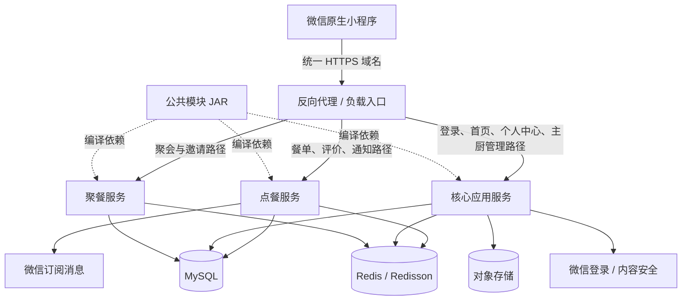
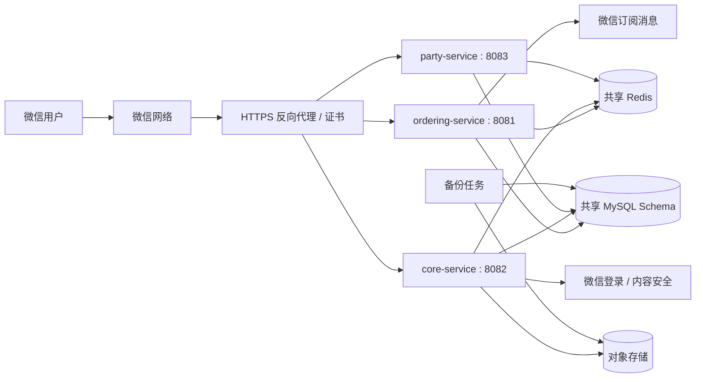
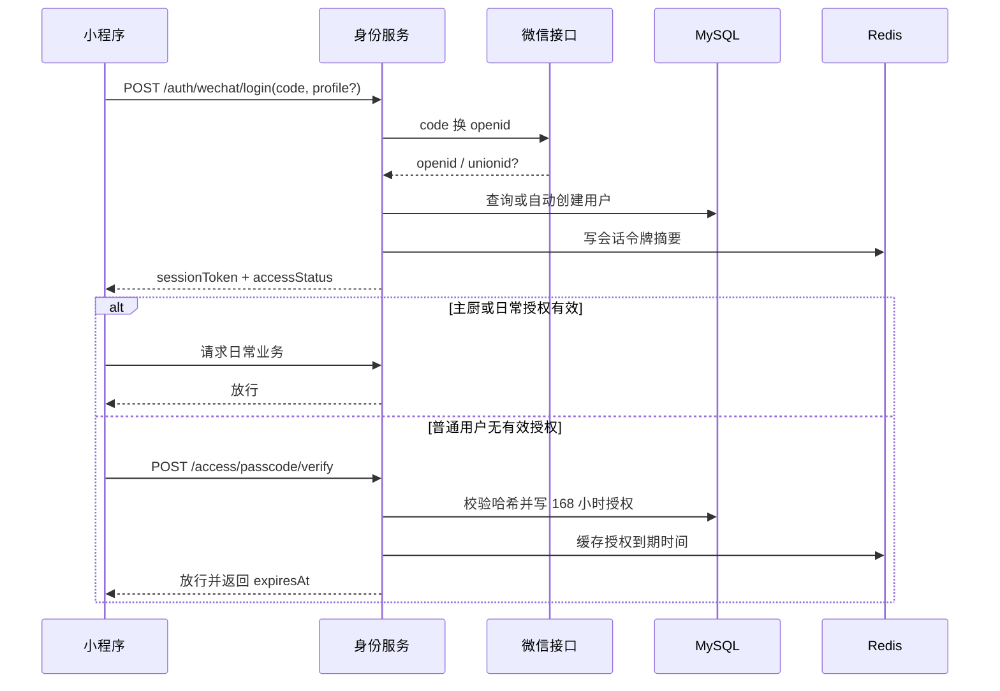
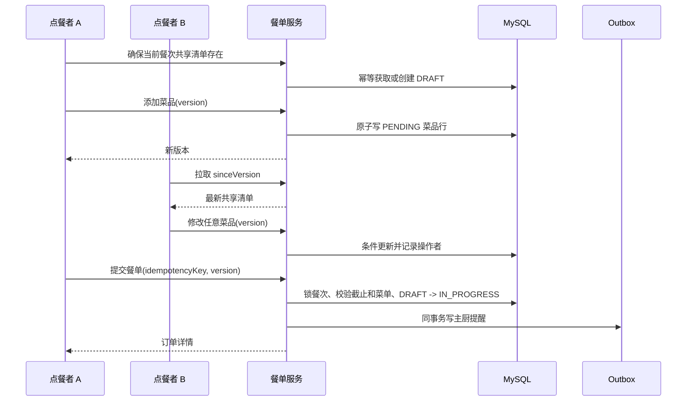
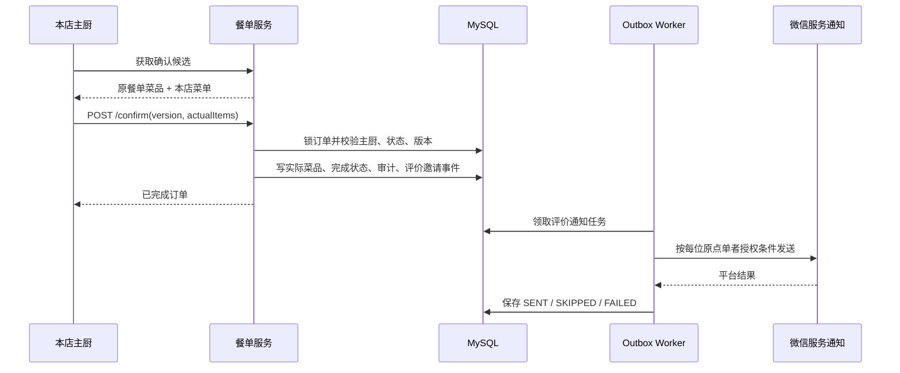
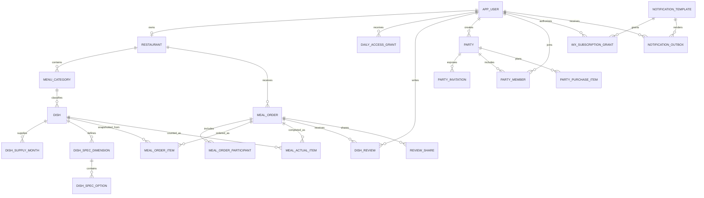

# “我们的餐桌”整体技术设计文档

| 项目 | 内容 |
| --- | --- |
| 文档版本 | v1.1 |
| 文档状态 | 首版开发技术基线 |
| 编写日期 | 2026-09-10 |
| 需求基线 | 《我们的餐桌功能需求说明书》v1.5 |
| UI 基线 | “我们的餐桌”小程序 UI v3 |
| 适用读者 | 产品、设计、前后端开发、测试、运维 |

### 修订记录

| 版本 | 日期 | 说明 |
| --- | --- | --- |
| v1.0 | 2026-09-09 | 建立整体架构、模块、接口、数据库、缓存、通知和部署设计基线 |
| v1.1 | 2026-09-10 | 按确认结果拆为点餐、核心应用、聚餐三个部署服务；公共模块只作为代码依赖；明确主厨管理位于小程序内 |

本文给出首版的整体架构、模块边界、核心流程、接口约定、数据库表结构、Redis 用法、并发幂等、微信能力接入、部署运维与测试方案。业务行为以 v1.5 需求文档为准；本文件负责说明如何实现，不改变已确认的权限、状态和统计口径。

配套交付物：

- [功能需求终稿](./我们的餐桌-需求文档.md)
- [v3 UI 设计说明](./UI设计/我们的餐桌小程序UI/小程序UI设计说明-v3.md)
- [MySQL 8.0 建表基线](./数据库设计/我们的餐桌-mysql-schema-v1.sql)

## 1. 设计目标与约束

### 1.1 设计目标

1. 支撑固定两家家庭餐厅、共同点餐、主厨确认实际菜品、评价统计及朋友聚会采购的完整闭环。
2. 所有权限、状态和统计均以服务端及 MySQL 数据为准，前端隐藏按钮不作为安全边界。
3. 按点餐、核心应用、聚餐三个功能服务独立部署，公共模块只作为代码依赖；控制服务数量，不引入独立网关、消息队列和注册中心。
4. 对重复点击、网络超时、多人同时改菜、采购认领和终态提交提供数据库级兜底。
5. 微信订阅消息不可用时不影响业务完成；站内状态和待办始终可查询。
6. 历史餐单、点餐人、菜品快照、评价、聚会成员与真实垫付记录可追溯。

### 1.2 已确认业务约束

- 系统固定两家餐厅和两位绑定主厨，不开放多商户入驻。
- 主厨无需接单；餐单提交后直接进入“进行中”。
- 所有具有日常资格的协作者均可修改当前餐单菜品；整单取消和完成按权限控制。
- 只有本餐厅主厨可以确认实际菜品并完成餐单。
- 实际补菜只可从本店已有菜单选择；菜单没有的菜不临时补录。
- 评价通道从餐单完成时刻起有效 7×24 小时，同一用户对同一餐单同一道菜只有一条评价。
- 聚会由创建者手动结束，可重开补报名、采购和金额，再次手动结束。
- 日常点餐没有价格、支付、配送和库存；金额只存在于聚会采购。
- 全部业务日期、餐次和节日按 `Asia/Shanghai` 计算。

### 1.3 技术选型

| 层次 | 选择 | 说明 |
| --- | --- | --- |
| 小程序 | 微信原生小程序 + TypeScript | 使用原生页面、组件和分包；不引入跨端框架 |
| 服务端 | Java 17、Spring Boot 3.x | 三个可独立部署的服务，共用父 BOM 和公共模块 |
| 数据访问 | MyBatis | SQL 显式可控，便于复杂权限、统计和并发更新 |
| 主数据库 | MySQL 8.0，InnoDB，`utf8mb4` | 业务事实、历史快照、Outbox 与幂等记录的唯一持久化来源 |
| 缓存与协调 | Redis 7.x、Redisson | 会话、访问凭证缓存、限流、短锁、热点缓存；不能作为共享清单唯一存储 |
| 图片 | 对象存储适配器 | 可接腾讯云 COS、S3 兼容存储或 MinIO；数据库只保存对象键和元数据 |
| 外部接口 | 微信登录、订阅消息、内容安全能力 | 全部通过适配器隔离，真实 AppID 与模板开发前联调 |
| 数据库迁移 | Flyway | DDL 与基础数据随版本管理，禁止启动时静默改表 |
| 接口文档 | OpenAPI 3 | 从控制器 DTO 和注解生成开发联调文档 |

不在首版引入独立 API Gateway、MQ、Elasticsearch、WebSocket 集群、服务注册中心和分布式事务。三个服务使用固定内网地址和统一 HTTPS 反向代理；数据库唯一约束、乐观锁、Outbox 和 Redisson 锁仍是并发兜底。

## 2. 总体架构

### 2.1 逻辑架构



### 2.2 分层结构

三个可部署服务内部采用相同的四层结构：

```text
api             Controller、请求响应 DTO、参数校验
application     用例编排、事务边界、权限调用、领域事件
domain          聚合、状态规则、值对象、仓储接口
infrastructure  MyBatis Mapper、Redis、微信、对象存储实现
```

`our-table-common` 提供公共实体、基础枚举、统一响应、异常、鉴权上下文、MyBatis 类型处理器和无状态工具类，不包含 Controller、业务编排、定时任务及任何可启动入口。业务 Mapper 仍放在表的归属服务中；共用实体不代表任意服务都可以改写全部表。

三个服务共用一个 MySQL Schema 以保留现有外键和本地事务。首版不增加服务间 HTTP 调用：需要跨模块的数据由消费服务通过专用只读 Mapper 查询，相关数据库实体来自 `our-table-common`。业务表只能由其归属服务写入；幂等记录和操作日志由三个服务通过公共组件写入，禁止借助公共实体绕过其他业务表的写边界。

### 2.3 部署架构



首版应用交付物只有三个后端服务和一个上传至微信平台的小程序。HTTPS 反向代理、MySQL、Redis 和对象存储属于运行基础设施，不计为业务后端服务。三个后端服务可先部署在同一台服务器的独立进程或容器中，每个服务首版各运行一个实例。

`ordering-service` 内运行餐次检查和通知 Outbox Worker；另外两个服务不消费点餐通知。即使某服务误启动第二实例，定时任务仍须通过数据库行锁、唯一键和 Redisson 锁保证幂等。

### 2.4 数据职责

| 数据 | 写入归属服务 | 权威来源 | Redis 用途 |
| --- | --- | --- | --- |
| 用户、主厨绑定、7 天日常准入 | `core-service` | MySQL | 登录会话、授权和用户摘要缓存 |
| 菜单、规格、供应月份、图片元数据 | `core-service` | MySQL；图片二进制在对象存储 | 菜单缓存、上传限流 |
| 共享清单、正式餐单、评价、通知 | `ordering-service` | MySQL | 版本缓存、短锁、首页查询缓存 |
| 首页推荐及聚合结果 | `core-service` | MySQL 推荐记录；业务明细仍在各归属表 | 首页 DTO 短缓存 |
| 聚会、成员、采购金额 | `party-service` | MySQL | 聚会摘要和认领短锁 |

数据库访问边界：

| 服务 | 可写业务表 | 允许只读的数据 |
| --- | --- | --- |
| `core-service` | 用户、授权、餐厅菜单、媒体、推荐和主题表 | 餐单、评价、聚会摘要，用于首页、个人中心和主厨工作台聚合 |
| `ordering-service` | 餐单、实际菜品、评价和通知表 | 用户资格、主厨绑定、菜单及媒体快照，用于下单和完成校验 |
| `party-service` | 聚会、成员和采购表 | 用户及媒体摘要，用于报名人、付款人和封面展示 |

生产环境为三个服务配置不同数据库账号，用表级权限落实上述读写范围。这样既不增加服务间网络依赖，也不会因为实体类位于公共模块而允许跨模块修改业务数据。

## 3. 模块设计

### 3.1 模块边界

| 工程模块 | 是否部署 | 内部功能 | 主要职责 |
| --- | --- | --- | --- |
| `our-table-ordering` | 是，`ordering-service` | 点餐、订单、实际菜品、评价、点餐通知 | 共同选菜、提交与追加、完成确认、评价分享、餐单统计事实和微信提醒 |
| `our-table-core` | 是，`core-service` | 登录、首页、个人中心、主厨管理、餐厅菜单、图片、主题 | 用户准入、首页聚合、个人资料、主厨入口及维护、菜单配置和公共页面能力 |
| `our-table-party` | 是，`party-service` | 聚餐、成员、邀请、采购、费用 | 创建报名、采购认领、垫付、人均、结束与重开 |
| `our-table-common` | 否，公共 JAR | 实体、基础枚举、通用 DTO、工具类、异常和鉴权组件 | 为三个服务提供稳定的公共代码，不承载业务接口或任务 |

Maven 工程结构：

```text
our-table-backend/
├── pom.xml                     父工程和依赖版本
├── our-table-common/           公共依赖，不生成可部署服务
│   └── com.myhome.table.common
│       ├── entity              数据库实体和基础值对象
│       ├── enums               公共状态及类型枚举
│       ├── dto                 稳定的公共请求响应模型
│       ├── security            会话解析和 UserContext
│       ├── persistence         类型处理器、分页和基础字段填充
│       ├── exception           统一异常与错误码
│       └── util                日期、摘要、脱敏等无状态工具
├── our-table-ordering/         点餐服务，端口 8081
│   └── com.myhome.table.ordering
├── our-table-core/             首页、个人中心及主厨管理服务，端口 8082
│   └── com.myhome.table.core
└── our-table-party/            聚餐服务，端口 8083
    └── com.myhome.table.party
```

小程序是唯一客户端。主厨从“我的”进入小程序内的主厨工作台；首版不建设独立 Web 管理后台。页面归属不要求后台接口集中在一个服务，例如主厨菜单维护调用 `core-service`，确认这顿饭调用 `ordering-service`。

### 3.2 身份与准入模块（core-service）

#### 登录与自动注册

1. 小程序调用 `wx.login` 获得一次性 `code`。
2. 服务端调用微信登录接口换取稳定 `openid`，`unionid` 仅在平台实际返回时保存。
3. 按 `openid` 查询用户；不存在则创建用户，默认昵称为用户主动提供的可用昵称，否则为“微信用户”。
4. 服务端签发随机不透明会话令牌，客户端只保存令牌，不保存 `openid` 作为鉴权凭证。
5. 会话在 Redis 中保存令牌摘要与用户 ID；失效后可重新静默登录，不影响业务数据。

#### 主厨绑定

- 主厨由 `restaurant.chef_user_id` 决定，每个用户最多绑定一家餐厅。
- 不提供前端“认领主厨”入口。
- 初始化时先让两位主厨完成登录，再由受控迁移脚本或运维命令按用户 ID 绑定两家餐厅。

#### 访问资格合并

| 资格来源 | 可访问范围 | 不授予的能力 |
| --- | --- | --- |
| 绑定主厨 | 全部日常顾客功能、本店工作台和本店菜单维护 | 另一家餐厅的主厨管理 |
| 有效日常密令授权 | 首页统计、两店菜单、共同点餐、本人可见订单、创建及参加聚会 | 任一主厨管理 |
| 聚会创建/成员记录 | 对应聚会详情、报名和采购协作 | 日常首页、菜单、其他聚会 |
| 有效评价分享 | 对应餐单的实际菜品和本人评价 | 完整订单、点餐者资料、日常导航 |

服务端按请求资源计算这些资格的并集，不能把某个邀请令牌转换成全局角色。日常密令过期不删除用户，也不撤销仍有效的聚会或评价范围。

#### 日常密令

- 为同时满足“校验密令”和“主厨查看复制”，数据库保存两份不同用途的数据：BCrypt 哈希用于校验，AES-256-GCM 密文用于授权主厨查看。加密密钥只从部署密钥配置读取，不与密文存放在数据库；每次查看均重新鉴权并写审计日志，明文不写日志和缓存。
- 同一用户在有效授权期内再次输入密令，不延长原到期时间。
- 修改密令只更新密令版本，不撤销已有授权。
- “立即撤销全部访客凭证”通过递增 `grant_generation` 实现；旧授权无需逐行更新即可立即失效。
- 连续失败次数和 10 分钟锁定放在 Redis，同时写安全日志；Redis 不可用时采用服务端进程内保守限流并告警。

### 3.3 餐厅与菜单模块（core-service）

- 餐厅固定两条有效记录，主厨只能维护自己餐厅。
- 普通品类可增删改；季节限定品类由初始化数据创建，禁止删除和改名。
- 菜品采用软删除，历史订单继续引用稳定菜品 ID 和下单快照。
- 菜品规格按“维度—选项”建模；每个维度只有一个默认选项。
- 顾客查询菜单时同时检查上架状态、删除状态、所选用餐日期月份和规格有效性。
- 主厨确认实际菜品时可选择原餐单菜品及本店仍存在的菜单菜品；下架和过季不阻止实际记录，未收录菜品不能临时创建。

### 3.4 共享清单与订单模块（ordering-service）

#### 聚合模型

技术上使用同一个 `meal_order` 聚合承载共享清单和正式餐单：

```text
DRAFT（共享清单） -> IN_PROGRESS（已提交） -> COMPLETED
                                      \-----> CANCELLED
DRAFT -------------------------------------> CANCELLED（清空或放弃时可物理清理草稿）
```

`DRAFT` 不属于用户看到的正式订单状态。首次成功提交时生成订单号和发起人并转为 `IN_PROGRESS`。同一餐厅、用餐日期、餐次只能有一个非取消聚合；取消后可建立新聚合，完成后不能重建。

`meal_order_item.item_stage` 区分 `PENDING`（首次共享清单或未提交追加）和 `SUBMITTED`（已进入正式餐单）。首次提交把全部待提交行转为正式行；订单进行中新增的菜先留在追加清单，只有再次提交才合并进正式餐单。对既有正式行修改规格、份数或删除则保存即生效，不再设置主厨审批步骤。

#### 日期与餐次计算

后端提供唯一的 `MealSlotClock` 计算业务日期、默认餐次、截止时刻和 `mealSlot`，前端只负责展示服务端结果。餐次码固定为早餐 1、午餐 2、晚餐 3、宵夜 4，`mealSlot = yyyyMMdd × 10 + 餐次码`。

| 餐次 | 用餐日 D 的截止/提醒时刻 | 默认选择区间 |
| --- | --- | --- |
| 早餐 | D 日 11:00 | 02:00—10:29 |
| 午餐 | D 日 15:00 | 10:30—14:29 |
| 晚餐 | D 日 21:00 | 14:30—20:59 |
| 宵夜 | D+1 日 02:00 | 21:00—23:59 为当日宵夜；00:00—01:59 为昨日宵夜 |

可选日期为今天、明天，凌晨额外开放尚未截止的昨日宵夜。服务端以 `Asia/Shanghai` 计算后把 `cutoff_at` 转成 UTC 保存；`now >= cutoff_at` 时拒绝普通点餐和追加，仍允许本店主厨确认实际菜品。

#### 协同编辑

- 菜品行按 `订单 + 菜品 + 规格摘要 + 原添加人` 区分。
- 数量加减使用原子 SQL；规格、人数和备注使用乐观锁版本号。
- 待提交行与正式行分别聚合；追加提交遇到同一添加人、同菜同规格的正式行时，事务内增加正式行数量并软移除待提交行，避免重复累计。
- 当前页面在前台时每 3 秒携带已知版本拉取增量或最新快照；进入页面、切换餐次和提交前强制刷新。
- 多行提交、取消和确认完成使用餐次短锁 `lock:meal:{restaurantId}:{mealSlot}`，数据库唯一键与状态条件仍是最终保障。
- 正式餐单中被删除的点餐行只标记移除，不物理删除，以保留原点餐人和评价邀请资格。
- 截止时仍未提交的追加行继续单独显示但不属于正式餐单。主厨确认页默认只带出 `SUBMITTED` 行；如这些菜确实做了，主厨可按本店菜单补入实际菜品。完成或取消时统一软移除遗留 `PENDING` 行并记录审计，不能悄悄并入正式餐单或把添加人算作已点单者。

#### 完成确认

- 只有 `restaurant.chef_user_id == currentUserId` 时返回并接受确认接口。
- 默认将当前有效点餐行转换成实际菜品编辑模型；主厨可删除、调整份数/规格，或从本店菜单补入。
- 确认请求在一个数据库事务内完成：锁定订单、校验版本和状态、写实际菜品、更新订单为完成、写操作日志，并为原点单者创建评价站内邀请和通知 Outbox。
- 空实际清单不能完成；“这顿没做”走取消流程。
- 完成和取消通过 `UPDATE ... WHERE status='IN_PROGRESS' AND version=?` 竞争，最多一个成功。

### 3.5 评价与统计模块（ordering-service + core-service）

- 评价唯一键为 `订单 + 菜品 + 评价人`，同菜不同规格共用一条评价。
- 首次评价必须在 `completed_at + 7 天` 之前。
- 首次提交后允许在 24 小时内修改一次，同时不能超过整单 7 天截止时刻。
- 分享链接使用 256 位随机令牌，数据库仅保存 SHA-256 摘要；链接权限只开放该订单实际菜品评价 DTO。
- 首页做饭次数、热门菜和 HOT 首版直接从已完成订单及实际菜品按索引聚合，结果缓存 60 秒。按家庭规模无需维护额外统计宽表，避免完成/取消补偿复杂度。
- 每日时令推荐写入 `daily_recommendation`，保证 Redis 清空后同一天仍保持一致；候选失效时重新选择。
- `ordering-service` 维护评价及餐单统计事实，`core-service` 负责首页接口和每日推荐；首页通过只读查询获取统计结果，不反向修改点餐数据。

### 3.6 聚会与采购模块（party-service）

```text
ACTIVE（活动中） <----重开---- ENDED（已结束）
        |-------------------->|
             创建者结束
```

- 计划结束时间只展示，不触发状态变化。
- 已结束时所有采购与报名写操作拒绝；重开后恢复为 `ACTIVE` 并标记页面“补充中”。
- 未被停用的邀请在重开后恢复可用；新邀请生成时旧邀请失效。
- 一个微信用户对应一个成员记录和一份平均分摊权重。
- 采购认领用条件更新 `assignee_user_id IS NULL`；两人同时认领只有一个成功。
- 已购金额与付款人是历史事实。成员退出、移除或采购转交不能静默改写付款人。
- 总费用为未移除且已购买项目金额之和；人均参考额为总费用除以当前有效报名人数，展示两位小数，不生成欠款。

### 3.7 通知模块（ordering-service）

- 下单、变更、取消、到点确认、完成评价邀请先在业务事务内写 `notification_outbox`。
- 后台任务每 5 秒领取到期任务，调用微信适配器，保存平台返回码和最终状态。
- 追加/修改提醒在首事件时间起固定 30 秒内合并；更新待发送记录的摘要，但不延长 `available_at`。
- 取消或完成时取消同订单尚未发送的进行中变更和到点提醒。
- 订阅次数按用户和模板记账，但以微信发送接口结果为准；本地剩余数只用于决定是否尝试，不能展示为平台绝对余额。
- 无模板、无授权、次数不足、发送失败均只影响通知状态，不回滚订单或评价业务。

### 3.8 图片与节日主题模块（core-service）

- 客户端裁切后上传，服务端再次校验 MIME、扩展名、文件头、大小和尺寸。
- 首版图片经后端接收后写入对象存储，避免客户端直接持有长期存储凭证。
- 餐厅封面保存 16:9 图，菜品图保存 1:1 图，同时生成列表缩略图；原图不超过 5 MiB。
- 历史订单保存图片对象键快照；替换当前图片不能删除仍被历史引用的对象。
- 节日主题按年份配置生效区间和优先级，缺少配置或素材时返回默认主题。

## 4. 核心流程设计

### 4.1 登录与日常准入



### 4.2 共同点餐与提交



### 4.3 主厨确认与评价邀请



### 4.4 聚会结束与重开

1. 创建者结束聚会时，按版本号将 `ACTIVE` 更新为 `ENDED`，记录首次及最近结束时间。
2. 已结束页面只读；计划时间到达不自动执行该操作。
3. 创建者重开时将状态改回 `ACTIVE`，写 `reopened_at` 和操作日志。
4. 原有效邀请重新允许报名；已停用邀请仍然无效。
5. 补报名、补采购或修正金额后再次结束，不创建新的账单版本。

## 5. 接口设计

### 5.1 通用约定

- 接口前缀：`/api/v1`。
- 小程序只使用一个正式 HTTPS 域名，反向代理按资源路径转发，不向小程序暴露服务端口，也不额外部署 API Gateway。
- 请求和响应使用 UTF-8 JSON；图片上传使用 `multipart/form-data`。
- 时间点使用 ISO 8601 UTC，例如 `2026-09-09T07:30:00.000Z`；业务用餐日使用 `yyyy-MM-dd`，服务端按 `Asia/Shanghai` 解释。
- 认证头：`Authorization: Bearer <session-token>`。
- 创建、提交、取消、完成、结束和重开接口必须携带 `Idempotency-Key`。
- 修改聚合必须携带 `version`；版本冲突返回 HTTP 409 和最新版本摘要。
- 列表统一使用游标分页；首版管理小列表可使用 `page/size`，`size` 最大 100。

路由归属：

| 公共路径 | 目标服务 |
| --- | --- |
| `/auth/**`、`/access/**`、`/users/**` | `core-service` |
| `/home/**`、`/restaurants/**`、`/media/**`、`/themes/**` | `core-service` |
| `/chef/restaurants/**`、`/chef/categories/**`、`/chef/dishes/**`、`/chef/access/**` | `core-service` |
| `/meal-slots/**`、`/meal-orders/**`、`/reviews/**`、`/review-invitations/**`、`/dishes/*/reviews` | `ordering-service` |
| `/chef/meal-orders/**`、`/notifications/**`、`/wechat/subscriptions/**` | `ordering-service` |
| `/parties/**`、`/party-invitations/**`、`/party-items/**` | `party-service` |

页面入口和后端服务不要求一一对应。例如小程序主厨工作台同时调用 `core-service` 的菜单维护接口和 `ordering-service` 的餐单确认接口。

统一响应：

```json
{
  "code": "OK",
  "message": "",
  "data": {},
  "requestId": "01J..."
}
```

统一错误码：

| HTTP | 错误码 | 含义 |
| --- | --- | --- |
| 400 | `VALIDATION_FAILED` | 字段格式、长度或范围错误 |
| 401 | `AUTH_REQUIRED` | 未登录或会话失效 |
| 403 | `ACCESS_REQUIRED` | 缺少日常、聚会或评价资格 |
| 403 | `CHEF_ONLY` | 仅本餐厅主厨可操作 |
| 404 | `RESOURCE_NOT_FOUND` | 资源不存在或无权访问时的统一隐藏响应 |
| 409 | `VERSION_CONFLICT` | 聚合已被他人更新 |
| 409 | `STATE_CONFLICT` | 当前状态不允许操作 |
| 409 | `MEAL_SLOT_OCCUPIED` | 同餐厅日期餐次已有有效餐单 |
| 410 | `INVITATION_EXPIRED` | 邀请已失效或评价期已结束 |
| 423 | `PASSCODE_LOCKED` | 密令错误次数达到锁定阈值 |
| 429 | `RATE_LIMITED` | 请求过于频繁 |

### 5.2 身份与准入接口

| 方法与路径 | 用途 | 权限/幂等 |
| --- | --- | --- |
| `POST /auth/wechat/login` | 用登录 code 查询或自动注册用户 | 匿名；code 一次性 |
| `POST /auth/logout` | 删除当前会话 | 已登录；幂等 |
| `GET /users/me` | 当前用户、主厨身份和资格摘要 | 已登录 |
| `PATCH /users/me/profile` | 修改昵称、头像 | 已登录；版本控制 |
| `GET /access/status` | 查询日常凭证到期时间 | 已登录 |
| `POST /access/passcode/verify` | 验证密令并获取 168 小时授权 | 已登录；受限流 |
| `GET /chef/access/passcode` | 解密查看/复制当前密令 | 任一绑定主厨；记录审计，不缓存明文 |
| `PUT /chef/access/passcode` | 修改日常密令 | 任一绑定主厨；版本控制 |
| `POST /chef/access/grants/revoke-all` | 撤销全部普通访客日常授权 | 任一绑定主厨；幂等键 |

### 5.3 餐厅与菜单接口

| 方法与路径 | 用途 | 权限 |
| --- | --- | --- |
| `GET /restaurants` | 获取固定两家餐厅 | 日常资格 |
| `GET /restaurants/{id}/menu` | 按用餐日期查询可点菜单 | 日常资格 |
| `GET /restaurants/{id}/dishes/{dishId}` | 菜品详情与评价摘要 | 日常资格 |
| `PATCH /chef/restaurants/{id}` | 修改本店名称和封面 | 本店主厨 |
| `POST /chef/restaurants/{id}/categories` | 新增普通品类 | 本店主厨 |
| `PATCH /chef/categories/{id}` | 修改品类 | 本店主厨 |
| `DELETE /chef/categories/{id}` | 删除空普通品类 | 本店主厨 |
| `POST /chef/restaurants/{id}/dishes` | 新增菜品及规格 | 本店主厨；幂等键 |
| `PATCH /chef/dishes/{id}` | 修改菜品、上下架、月份和规格 | 本店主厨；版本控制 |
| `DELETE /chef/dishes/{id}` | 软删除菜品 | 本店主厨；版本控制 |
| `GET /chef/dishes/{id}/recipe` | 查看私房做法 | 本店主厨；专用 DTO |

### 5.4 共享清单与订单接口

| 方法与路径 | 用途 | 关键规则 |
| --- | --- | --- |
| `GET /meal-slots/{restaurantId}/{date}/{period}` | 获取共享清单或已有餐单 | 无聚合时返回 `orderId=null`；不在 GET 中创建数据 |
| `PUT /meal-slots/{restaurantId}/{date}/{period}/draft` | 幂等获取或创建当前餐次共享清单 | 日常资格、未截止；返回订单 ID 与版本 |
| `POST /meal-orders/{id}/items` | 添加菜品行 | 日常资格、未截止、菜单有效；进行中订单先写追加清单 |
| `PATCH /meal-orders/{id}/items/{itemId}` | 改规格或份数 | 正式行保存即生效，待提交行只影响共享/追加清单；版本控制 |
| `DELETE /meal-orders/{id}/items/{itemId}` | 移除菜品行 | 待提交行直接移除；正式单最后一道按取消权限处理 |
| `PATCH /meal-orders/{id}/meta` | 改用餐人数和备注 | 按权限矩阵、版本控制 |
| `POST /meal-orders/{id}/submit` | 首次提交或把追加清单并入原单 | 幂等、截止复核、菜单复核；不得重复累计已提交份数 |
| `POST /meal-orders/{id}/cancel` | 取消餐单 | 本店主厨或发起人、幂等 |
| `GET /meal-orders` | 当前与历史餐单列表 | 按本店主厨/参与者过滤 |
| `GET /meal-orders/{id}` | 完整订单详情 | 不向评价分享资格返回该接口 |
| `GET /chef/meal-orders/{id}/confirmation` | 获取实际菜品确认候选 | 仅本店主厨 |
| `POST /chef/meal-orders/{id}/confirm` | 写实际菜品并完成 | 仅本店主厨、幂等、版本控制 |
| `POST /chef/meal-orders/{id}/not-cooked` | 整顿没做并取消 | 仅本店主厨、幂等 |

`POST /chef/meal-orders/{id}/confirm` 请求示例：

```json
{
  "version": 7,
  "actualItems": [
    {
      "dishId": 101,
      "sourceOrderItemId": 9001,
      "quantity": 2,
      "specSelections": [
        {"dimensionId": 11, "optionId": 31}
      ]
    },
    {
      "dishId": 108,
      "sourceOrderItemId": null,
      "quantity": 1,
      "specSelections": []
    }
  ]
}
```

服务端不能接受请求中的菜名、餐厅 ID 或评分统计作为可信事实，均按 `dishId` 和订单上下文重新查询并生成快照。

### 5.5 评价与首页接口

| 方法与路径 | 用途 | 关键规则 |
| --- | --- | --- |
| `GET /home/summary?period=week&scope=family` | 首页统计、趋势、热门和时令推荐 | 日常资格；60 秒缓存 |
| `GET /meal-orders/{id}/review-sheet` | 正常餐单访问者获取评价页 | 已完成且 7 天内；包括本店主厨 |
| `POST /meal-orders/{id}/reviews` | 正常餐单访问者逐菜评价 | 一菜一条；可多次补未评菜 |
| `PATCH /reviews/{id}` | 修改本人评价 | 24 小时内一次且未超过整单截止 |
| `POST /meal-orders/{id}/review-shares` | 生成评价分享 | 有该单评价资格；幂等键 |
| `GET /review-invitations/{token}` | 好友评价受限落地数据 | 未登录只返回邀请摘要 |
| `POST /review-invitations/{token}/reviews` | 好友登录后评价 | 自动注册用户；仅实际菜品 |
| `GET /dishes/{id}/reviews` | 菜品公开于日常菜单的评价分页 | 日常资格 |

### 5.6 聚会接口

| 方法与路径 | 用途 | 关键规则 |
| --- | --- | --- |
| `POST /parties` | 创建聚会并自动报名创建者 | 日常资格；幂等键 |
| `GET /parties` | 本人创建、报名或曾参与列表 | 登录用户 |
| `GET /parties/{id}` | 聚会详情 | 创建者或成员；未报名邀请只走邀请接口 |
| `PATCH /parties/{id}` | 修改主题、地点和时间 | 创建者、活动中、版本控制 |
| `POST /parties/{id}/invitations` | 生成新邀请并停用旧邀请 | 创建者、幂等键 |
| `DELETE /parties/{id}/invitations/current` | 停用邀请 | 创建者、幂等 |
| `GET /party-invitations/{token}` | 邀请摘要 | 有效令牌；不返回采购明细 |
| `POST /party-invitations/{token}/join` | 报名或重新报名 | 聚会活动中；一账号一成员 |
| `POST /parties/{id}/leave` | 退出 | 先解除待采购任务；创建者不可退出 |
| `DELETE /parties/{id}/members/{memberId}` | 移除误报名成员 | 创建者；保留垫付事实 |
| `POST /parties/{id}/items` | 新增采购项 | 当前成员；幂等键 |
| `PATCH /party-items/{id}` | 修改、认领、购买或金额纠错 | 按创建者/负责人权限；版本控制 |
| `DELETE /party-items/{id}` | 移除采购项 | 已购项需原因和二次确认结果 |
| `POST /parties/{id}/end` | 手动结束聚会 | 创建者、幂等、版本控制 |
| `POST /parties/{id}/reopen` | 重开补充 | 创建者、幂等、版本控制 |

### 5.7 通知、图片与配置接口

| 方法与路径 | 用途 | 权限 |
| --- | --- | --- |
| `POST /wechat/subscriptions/consents` | 记录用户对模板的授权结果 | 已登录；请求须携客户端操作流水号 |
| `GET /notifications/todos` | 站内待办与最新业务状态 | 已登录 |
| `POST /media/images` | 上传并校验图片 | 已登录；按用途检查主厨/创建者权限 |
| `GET /themes/current` | 获取当前节日主题 | 日常资格；无配置返回默认 |

## 6. 数据库设计

### 6.1 设计原则

1. 使用 `BIGINT UNSIGNED AUTO_INCREMENT` 作为内部主键；对外订单号和随机邀请令牌与内部 ID 分离。
2. 所有业务时间点使用 `DATETIME(3)` 并统一按 UTC 写入；`meal_date` 是北京时间业务日期，单独使用 `DATE`。
3. 金额统一使用 `DECIMAL(10,2)`，不使用浮点数。
4. 当前菜单数据规范化存储，历史订单使用快照字段防止后续改名、删菜或换图倒改历史。
5. 聚合根包含 `version` 乐观锁字段；状态更新必须同时带旧状态和版本条件。
6. 软删除表使用 `deleted_at`；有效名称唯一通过生成列实现，不依赖 MySQL 对多个 `NULL` 的普通组合判断。
7. JSON 只用于不可独立查询的历史快照和通知载荷，不用于角色、状态、金额、日期等核心条件。
8. 外键保证基本引用关系；业务状态、跨表权限和复杂条件由事务服务校验。
9. 三个服务共用一个 Schema；业务表只允许归属服务写入，其他服务只能通过经过评审的专用只读 Mapper 查询。
10. `our-table-common` 存放数据库实体和公共类型，但不放业务 Mapper。数据库迁移由 `core-service` 在其余两个服务启动前统一执行，避免三个进程重复运行 Flyway。

### 6.2 表清单

| 归属服务 | 分组 | 表名 | 用途 |
| --- | --- | --- | --- |
| `core-service` | 身份 | `app_user` | 微信稳定身份和当前显示资料 |
| `core-service` | 身份 | `daily_access_secret` | 当前密令校验哈希、可查看密文和撤销代次 |
| `core-service` | 身份 | `daily_access_grant` | 普通用户 168 小时授权历史 |
| `core-service` | 媒体 | `media_asset` | 图片对象键、尺寸、哈希和状态 |
| `core-service` | 餐厅 | `restaurant` | 固定双餐厅及主厨绑定 |
| `core-service` | 菜单 | `menu_category` | 普通/季节限定品类 |
| `core-service` | 菜单 | `dish` | 菜品、图片、做法、上下架 |
| `core-service` | 菜单 | `dish_supply_month` | 季节菜供应月份 |
| `core-service` | 菜单 | `dish_spec_dimension` | 规格维度 |
| `core-service` | 菜单 | `dish_spec_option` | 规格选项和默认值 |
| `ordering-service` | 餐单 | `meal_order` | 共享清单和正式餐单聚合 |
| `ordering-service` | 餐单 | `meal_order_participant` | 发起人、点单者、协作者和本店主厨 |
| `ordering-service` | 餐单 | `meal_order_item` | 原始点餐行、追加阶段及移除记录 |
| `ordering-service` | 餐单 | `meal_actual_item` | 主厨最终确认的实际菜品 |
| `ordering-service` | 评价 | `dish_review` | 按订单、菜品和评价人唯一的评价 |
| `ordering-service` | 评价 | `review_share` | 7 天受限评价分享令牌 |
| `core-service` | 推荐 | `daily_recommendation` | 每日稳定时令推荐 |
| `party-service` | 聚会 | `party` | 聚会基本信息与状态 |
| `party-service` | 聚会 | `party_invitation` | 可停用、轮换的邀请令牌 |
| `party-service` | 聚会 | `party_member` | 一账号一成员及退出/移除状态 |
| `party-service` | 聚会 | `party_purchase_item` | 认领、购买、金额和付款事实 |
| `ordering-service` | 通知 | `notification_template` | 业务事件到微信模板映射 |
| `ordering-service` | 通知 | `wx_subscription_grant` | 用户模板授权累计与消费记账 |
| `ordering-service` | 通知 | `notification_outbox` | 异步通知任务、合并和发送结果 |
| `core-service` | 主题 | `festival_theme_config` | 年度节日区间、优先级和素材 |
| 三服务公共组件 | 支撑 | `api_idempotency_record` | 按服务和路由隔离的幂等响应 |
| 三服务公共组件 | 支撑 | `biz_operation_log` | 订单、聚会、菜单和权限操作审计 |

完整首版 DDL 见同目录的 `数据库设计/我们的餐桌-mysql-schema-v1.sql`。

### 6.3 核心实体关系



### 6.4 关键表字段

#### `app_user`

| 字段 | 类型 | 说明 |
| --- | --- | --- |
| `id` | BIGINT UNSIGNED | 内部用户 ID |
| `openid` | VARCHAR(64) | 当前小程序稳定身份，唯一 |
| `unionid` | VARCHAR(64) NULL | 平台实际返回时保存 |
| `nickname` | VARCHAR(20) | 当前可修改昵称 |
| `avatar_url` | VARCHAR(500) NULL | 当前头像地址或对象访问地址 |
| `status` | VARCHAR(16) | `ACTIVE/DISABLED` |
| `version` | BIGINT UNSIGNED | 乐观锁 |

#### `meal_order`

| 字段 | 类型 | 说明 |
| --- | --- | --- |
| `restaurant_id` | BIGINT UNSIGNED | 餐单归属餐厅 |
| `meal_date` | DATE | 北京时间用餐日 |
| `meal_period` | VARCHAR(16) | `BREAKFAST/LUNCH/DINNER/SUPPER` |
| `meal_slot` | BIGINT UNSIGNED | `yyyyMMdd * 10 + 餐次码`，用于唯一约束 |
| `status` | VARCHAR(20) | `DRAFT/IN_PROGRESS/COMPLETED/CANCELLED` |
| `occupying_marker` | TINYINT 生成列 | 非取消状态为 1，取消状态为 NULL |
| `initiator_user_id` | BIGINT UNSIGNED NULL | 首次提交人 |
| `diner_count` | TINYINT UNSIGNED | 1—20，默认 2 |
| `remark` | VARCHAR(100) NULL | 整单备注 |
| `cutoff_at` | DATETIME(3) | 停止普通点餐及提醒时刻 |
| `version` | BIGINT UNSIGNED | 多人修改版本 |

唯一键 `(restaurant_id, meal_slot, occupying_marker)` 保证同一餐次只有一个非取消聚合，同时允许保留多张取消历史单。

#### `meal_order_item` 与 `meal_actual_item`

`meal_order_item` 保存“谁点了什么”，并以 `item_stage` 区分未提交追加和正式餐单；被移除只写 `removed_at`。`meal_actual_item` 保存“最后实际做了什么”。两个集合不能混用，否则无法同时满足原点单者通知和实际菜品统计。

| 关键字段 | 点餐行 | 实际菜品 |
| --- | --- | --- |
| 用户关系 | `contributor_user_id` | `confirmed_by_user_id` |
| 菜品关系 | `dish_id` + 快照 | `dish_id` + 快照 |
| 规格 | `spec_key` + `spec_snapshot` | `spec_key` + `spec_snapshot` |
| 阶段 | `PENDING/SUBMITTED` | 完成时一次写入 |
| 数量 | 当前/提交数量 | 实际数量 |
| 删除 | `removed_at` 保留历史 | 完成后冻结，不允许删除 |
| 来源 | 用户点餐 | `ORDERED/CONFIRM_ADDED` |

#### `dish_review`

唯一键 `(meal_order_id, dish_id, reviewer_user_id)` 实现同菜跨规格只评一次。`first_submitted_at`、`modified_at` 和 `modify_count` 共同校验“24 小时内修改一次”；订单 `completed_at` 校验总 7 天期限。

#### `party_purchase_item`

| 字段 | 说明 |
| --- | --- |
| `creator_user_id` | 新增物品的人 |
| `assignee_user_id` | 当前采购负责人，可为空 |
| `purchase_status` | `TODO/PURCHASED` |
| `payer_user_id` | 实际垫付人，购买后不可被转交操作覆盖 |
| `amount` | 0—99999.99，最多两位小数 |
| `zero_amount_note` | 0 元时必填说明 |
| `removed_at` | 移除后不计总费用，历史仍保留 |
| `version` | 认领、购买和纠错的乐观锁 |

#### `notification_outbox`

业务事务只写 Outbox，不直接等待微信接口。`event_key` 防止同一业务事件重复创建；`available_at` 决定发送时间；`merge_key` 用于 30 秒变更合并；`status` 和 `attempt_count` 支持可观察重试。

### 6.5 索引设计

| 查询场景 | 索引 |
| --- | --- |
| 微信登录 | `app_user(openid)` 唯一 |
| 当前日常授权 | `daily_access_grant(user_id, expires_at, revoked_at)` |
| 顾客菜单 | `dish(restaurant_id, category_id, is_on_shelf, deleted_at)` |
| 餐次聚合 | `meal_order(restaurant_id, meal_slot, occupying_marker)` 唯一 |
| 用户历史餐单 | `meal_order_participant(user_id, meal_order_id)` |
| 主厨工作台 | `meal_order(restaurant_id, status, cutoff_at)` |
| 热门菜 | `meal_actual_item(dish_id, meal_order_id)` + `meal_order(status, meal_date)` |
| 菜品评价 | `dish_review(dish_id, first_submitted_at)` |
| 聚会列表 | `party_member(user_id, party_id)`、`party(creator_user_id, start_at)` |
| 采购统计 | `party_purchase_item(party_id, purchase_status, removed_at)` |
| 待发通知 | `notification_outbox(status, available_at)` |
| 幂等查询 | `api_idempotency_record(user_id, route_key, idempotency_key)` 唯一 |

索引必须根据真实 `EXPLAIN` 和数据量调整。首版家庭数据量很小，不创建只为假想大规模准备的冗余索引。

### 6.6 数据保留与清理

- 会话和错误限流按 Redis TTL 自动清理。
- 过期日常授权保留 90 天后清理，安全审计摘要继续保留。
- 已完成/取消餐单、评价、聚会、成员和垫付记录默认长期保留，用户资料删除时按平台要求去标识化。
- Outbox 成功记录保留 90 天，失败及安全相关记录保留 180 天；清理前聚合监控指标。
- 未提交且 30 天无更新的 `DRAFT` 可由任务清理；清理不影响正式订单。
- 图片只有在没有当前实体和历史快照引用时才可进入延迟删除队列。

## 7. Redis 设计

### 7.1 Key 规范

| Key | Value | TTL/失效 |
| --- | --- | --- |
| `core:sess:{tokenHash}` | 用户 ID、签发时间、会话版本 | 建议 30 天；重新登录续签 |
| `core:access:{userId}` | 日常授权 ID、到期时间、grant generation | 不超过授权剩余时间 |
| `core:passcode:fail:{userId}` | 连续失败次数 | 10 分钟 |
| `core:passcode:lock:{userId}` | 锁定标识 | 10 分钟 |
| `core:menu:{restaurantId}:{date}` | 可点菜单摘要 | 5 分钟；菜单变更主动删除 |
| `ordering:meal:version:{restaurantId}:{mealSlot}` | 当前餐单 ID 和版本 | 10 分钟；写入后刷新 |
| `core:home:{scope}:{periodKey}` | 首页统计 DTO | 60 秒；订单完成/评价后删除 |
| `party:summary:{partyId}` | 成员、费用摘要 | 60 秒；任何采购/成员变化删除 |
| `{service}:ratelimit:{scene}:{userId}` | 各服务限流计数 | 按场景 1—10 分钟 |

锁 Key：

```text
ordering:lock:meal:{restaurantId}:{mealSlot}
party:lock:party:{partyId}
party:lock:item:{itemId}
ordering:lock:outbox:{eventId}
```

### 7.2 使用规则

- Redis 命中只减少查询，不能跳过数据库权限和状态校验。
- 锁等待时间和租约必须有上限；事务结束立即释放，不能在锁内调用微信或对象存储等慢外部接口。
- 锁丢失时依靠数据库唯一键、版本号和状态条件保证正确性。
- 菜单、统计和聚会摘要采用 Cache-Aside；先提交数据库事务，再删除缓存。`ordering-service` 完成餐单或写评价后删除对应 `core:home:*` 缓存，不直接写首页推荐表。
- 不缓存私房做法到普通菜单 DTO，也不把完整邀请令牌写入日志或通用缓存。

## 8. 并发、一致性与幂等

### 8.1 一致性级别

- 订单提交、取消、完成，聚会结束/重开，采购购买金额和评价写入要求数据库强一致。
- 菜单缓存、首页统计和在线协同页面允许 3 秒内最终可见。
- 微信消息只保证任务可追踪，不保证平台即时送达。

### 8.2 关键并发策略

| 场景 | 首层控制 | 数据库兜底 |
| --- | --- | --- |
| 两人同时创建同餐次草稿 | 餐次 Redisson 锁 | 餐次占用唯一键 |
| 同时增加同一菜品份数 | 原子增量 SQL | `quantity` 检查约束 |
| 同时改规格/人数/备注 | 聚合版本号 | `WHERE version=?` 条件更新 |
| 两人同时提交 | 餐次锁 + 幂等键 | 状态条件 + 占用唯一键 |
| 完成与取消并发 | 订单锁 | `status='IN_PROGRESS' AND version=?` |
| 两人认领同一采购项 | 项目短锁 | `WHERE assignee_user_id IS NULL` |
| 重复评价 | 用户操作幂等 | 评价唯一键 |
| 重复生成通知 | 事件键 | `notification_outbox.event_key` 唯一 |

### 8.3 幂等记录

客户端对以下操作生成 UUID 作为 `Idempotency-Key`：创建聚会、提交餐单、取消、确认完成、聚会结束/重开、生成分享、上传图片元数据。

服务端以 `(user_id, route_key, idempotency_key)` 唯一保存请求哈希与成功响应：

- 同键同请求返回原响应。
- 同键不同请求返回 `IDEMPOTENCY_KEY_REUSED`。
- 记录处于处理中时返回 409 或短暂等待，不能再次执行副作用。
- 记录建议保留 24 小时；订单和聚会自身唯一约束继续长期兜底。

### 8.4 事务边界

| 用例 | 同一事务内必须完成 |
| --- | --- |
| 提交餐单 | 锁聚合、菜单复核、状态更新、参与者、操作日志、主厨通知 Outbox |
| 修改正式餐单 | 菜品行、参与者/点单者标记、聚合版本、操作日志、变更 Outbox |
| 确认完成 | 实际菜品、订单状态、原点单者邀请、操作日志、评价 Outbox |
| 提交评价 | 评价写入、修改次数、操作日志、统计缓存失效标记 |
| 购买采购项 | 状态、付款人、金额、版本、操作日志 |
| 聚会结束/重开 | 聚会状态、时间、版本、操作日志 |

对象存储和微信调用均不放在业务数据库事务内。图片采用“先上传临时对象—业务保存引用—异步清理孤儿对象”；消息采用 Outbox。

## 9. 定时任务与通知发送

### 9.1 定时任务

| 归属服务 | 任务 | 频率 | 行为 |
| --- | --- | --- | --- |
| `ordering-service` | 餐次到点检查 | 每分钟 | 查找 `IN_PROGRESS` 且 `cutoff_at <= now` 且未创建提醒的订单，写唯一 Outbox |
| `ordering-service` | Outbox 发送 | 每 5 秒 | 分批领取到期任务，调用微信并记录结果 |
| `ordering-service` | Outbox 重试 | 随发送任务 | 网络/5xx 指数退避；业务无效或平台明确拒绝不重试 |
| `ordering-service` | 草稿清理 | 每日 | 清理 30 天无更新且未提交草稿 |
| `core-service` | 过期授权清理 | 每日 | 清理超过保留期的授权和幂等记录 |
| `core-service` | 孤儿图片清理 | 每日 | 删除超过 24 小时仍无业务引用的临时对象 |

餐次检查使用 `(event_type, order_id, recipient_id)` 形成唯一 `event_key`，服务恢复后补跑也不会重复创建。

### 9.2 Outbox 状态

```text
PENDING -> SENDING -> SENT
                  -> FAILED_RETRYABLE -> PENDING
                  -> FAILED_FINAL
PENDING/SENDING -> CANCELLED（业务终态使旧提醒失效）
PENDING -> SKIPPED（无模板、无授权或无次数）
```

领取 SQL 使用小批量行锁；首版 `ordering-service` 虽只运行一个实例，仍采用 `SELECT ... FOR UPDATE SKIP LOCKED`，为任务重入和未来扩容提供保护。发送前再次检查订单当前状态和收件人权限，旧通知不能绕过最新状态。

### 9.3 微信订阅授权

1. 小程序只能在用户点击等平台允许的上下文调用 `wx.requestSubscribeMessage`。
2. 客户端将模板 ID、授权结果和一次性操作流水号回传服务端。
3. 服务端仅把 `accept` 记录为可尝试次数；`reject/ban` 保存最新状态但不阻断业务。
4. Worker 发送前锁定授权记录并预占一次；平台成功后记为已消费，失败按平台错误类型回滚预占或标记失效。
5. 主厨的下单/到点提醒授权与点单者的评价邀请授权分别管理，不能互相替代。

真实模板 ID、字段、类目和平台错误码映射必须在阶段 0 使用真实小程序账号联调后配置，不能写死在业务代码。

## 10. 权限与安全设计

### 10.1 访问上下文

每次请求由鉴权过滤器构造：

```text
UserContext
├── userId
├── ownedRestaurantId?       当前用户作为主厨拥有的餐厅
├── dailyAccessExpiresAt?    日常资格
├── partyMemberships         当前请求按 partyId 查询，不全量塞会话
└── reviewInvitationScope?   当前 token 对应的单餐单受限资格
```

三个服务都引入 `our-table-common` 的鉴权过滤器。过滤器对 Bearer 令牌做摘要后读取 `core:sess:*`，再结合 `core:access:*` 构造访问上下文；Redis 缓存缺失时，通过只读查询从 MySQL 恢复用户和授权事实。只有 `core-service` 可以签发、续期或撤销会话与日常授权。

权限检查顺序：认证身份 → 资源存在 → 资格范围 → 角色动作 → 业务状态 → 数据版本。对无权查看的订单、做法和其他聚会统一返回 404，减少通过 ID 探测数据。

### 10.2 DTO 隔离

- 顾客菜单 DTO 不包含 `recipe`。
- 评价邀请 DTO 只包含餐厅显示名、用餐日期餐次、实际菜品和本人评价，不包含点餐者名单、备注和做法。
- 未报名聚会邀请 DTO 只包含主题、封面、时间、地点和报名状态，不包含成员资料、采购和金额。
- 列表 DTO 不复用数据库实体，避免新增字段后意外泄露。

### 10.3 密令与令牌

- 日常密令校验使用 BCrypt；授权查看使用 AES-256-GCM 密文，密钥由部署环境注入并支持版本轮换。明文不写日志、缓存、监控标签或异常信息。
- 会话令牌、聚会邀请和评价分享令牌均使用安全随机数生成，至少 256 位熵。
- 数据库只保存邀请令牌 SHA-256 摘要；收到链接后先哈希再查询。
- 二次确认必须由前端明确展示后再调用真正写接口，后端不接受仅靠前端布尔值绕过权限。

### 10.4 上传安全

- 最大原图 5 MiB，只允许经过文件头验证的 JPEG/PNG。
- 重编码移除 EXIF，避免泄露位置等元数据；限制像素总量，防止解压炸弹。
- 对象键由服务端生成，不使用原文件名拼路径。
- 内容安全检查失败时不发布新图，旧图继续有效。

### 10.5 审计与隐私

- 记录操作者稳定用户 ID、操作类型、业务 ID、时间、请求 ID 和必要差异摘要。
- 不在业务日志中记录完整 `openid`、会话令牌、密令、邀请令牌、私房做法和微信接口凭证。
- 昵称和头像变化不修改历史点餐人、评价者和付款人归属；历史展示可使用快照或当前昵称，具体页面按需求定义。

## 11. 前端设计

### 11.1 小程序目录建议

```text
miniprogram/
├── app.ts / app.json / app.wxss
├── api/                 统一请求、认证刷新、错误映射
├── models/              TypeScript DTO
├── stores/              用户、访问上下文、当前餐次轻量状态
├── components/          菜品行、餐次选择、状态标签、空态等
├── pages/
│   ├── home
│   ├── ordering
│   ├── orders
│   ├── parties
│   ├── profile
│   ├── chef
│   └── invitation
├── subpackages/         菜品详情、评价、聚会编辑、后台维护
├── styles/              v3 色彩、字体、间距 Token
└── utils/               日期餐次、幂等键、图片处理
```

这是项目唯一的前端工程。`pages/chef` 及其后台维护分包仍属于微信小程序，由绑定主厨从“我的”进入；不存在独立后台 Web 工程。

小程序 `api` 层只配置一个 `PUBLIC_BASE_URL`，按资源路径调用三个服务。页面不感知服务端端口，也不保存某个服务的内网地址。

### 11.2 状态管理

- 全局只保存会话、用户摘要、日常资格和当前选择餐厅；订单、菜单和聚会详情以页面请求数据为准。
- 当前共享清单本地只作为渲染副本，服务端返回版本才是权威；断网时不显示提交成功。
- 页面隐藏/返回前停止 3 秒轮询，重新进入立即拉取最新版本。
- 编辑内容和服务端版本分开保存；冲突时展示差异并让用户核对，不能直接覆盖。

### 11.3 分包与性能

- 主包保留登录、首页、五 Tab 骨架和通用组件。
- 主厨维护、评价分享和聚会编辑进入分包，降低冷启动体积。
- 列表使用缩略图和懒加载；详情图进入页面后加载。
- 首屏请求合并为登录上下文 + 首页聚合接口，避免多次串行请求。
- v3 宋体标题若使用自定义字体，只打包必要汉字子集；正文使用系统黑体回退，字体失败不阻塞页面。

## 12. 可观测性与运维

### 12.1 日志

统一 JSON 日志字段：`timestamp`、`level`、`serviceName`、`requestId`、`userIdMasked`、`module`、`action`、`bizId`、`resultCode`、`durationMs`。反向代理透传同一个 `requestId`，便于关联三个服务；外部微信请求额外记录 `platformRequestId` 和脱敏错误码，不记录 access token。

### 12.2 指标

| 指标 | 用途 |
| --- | --- |
| HTTP 请求量、P95、5xx、业务错误码 | 接口健康与性能 |
| 数据库连接池、慢 SQL、事务回滚 | 数据层健康 |
| Redis 命中率、超时、锁等待 | 缓存与并发问题 |
| Outbox 待发送数、最老年龄、成功/失败/跳过 | 通知积压与平台异常 |
| 到点提醒生成延迟 | NFR-06 验收 |
| 图片上传失败和内容检查失败 | 媒体链路 |

### 12.3 告警建议

- 连续 5 分钟 5xx 比例超过 5%。
- Outbox 最老待发送任务超过 5 分钟。
- 餐次到点事件生成延迟超过 2 分钟。
- 数据库连接池使用率超过 80% 持续 5 分钟。
- Redis 不可用或锁错误持续 1 分钟。
- 每日备份失败或超过 26 小时没有成功备份。

### 12.4 备份与恢复

首版建议目标：`RPO ≤ 24 小时`、`RTO ≤ 4 小时`，上线前由部署方确认。

- MySQL 每日全量备份并保留 30 天；条件允许时开启 binlog 以缩短 RPO。
- 对象存储开启版本控制或生命周期保护，保留与数据库备份一致的历史窗口。
- 配置、Flyway 脚本和节日素材清单纳入版本管理。
- 至少执行一次隔离环境恢复演练，检查用户、菜单、历史图片、餐单实际菜品、评价和聚会金额。
- 恢复后 Redis 从空缓存启动，系统仍须正确工作。

## 13. 测试设计

### 13.1 测试层次

| 层次 | 重点 |
| --- | --- |
| 单元测试 | 餐次计算、权限决策、状态转换、评价期限、人均金额、统计口径 |
| Mapper 集成测试 | 唯一键、乐观锁、软删除、金额精度、JSON 快照和查询索引 |
| 应用集成测试 | 提交、完成、取消、评价、重开等事务边界及 Outbox |
| API 测试 | 身份范围、错误码、幂等重放、版本冲突和 DTO 字段泄露 |
| 并发测试 | 两人共同点餐、同时提交、完成/取消竞争、10 人认领采购 |
| 小程序测试 | 日期餐次、断网保留、3 秒同步、分包、图片上传和受限邀请页 |
| 真机联调 | 微信登录、昵称填写、订阅授权、服务通知、分享卡片和跳转 |
| 恢复测试 | MySQL + 对象存储恢复、Redis 空启动、Outbox 恢复后补发判断 |

### 13.2 必测技术场景

1. 两个客户端同时加一份，最终数量增加 2；同时减至零不出现负数。
2. 两个用户同时提交同餐次，只产生一张有效订单和一条首次下单事件。
3. 完成与取消并发，只允许一个状态成功；重复完成不重复统计和评价邀请。
4. 非本店主厨直接调用确认接口返回 `CHEF_ONLY`。
5. 删除点餐者所有菜后完成，该用户仍保留原点单者身份和站内评价邀请。
6. 分享令牌被猜测、篡改、停用或超过 7 天时不能返回完整订单或提交评价。
7. 聚会结束时旧邀请不能报名；重开后未停用邀请可补报名。
8. 退出成员已有垫付时，金额和付款人仍存在于总费用和历史记录。
9. Redis 清空后，授权可从数据库重建、共享清单不丢、同日时令推荐不变化。
10. 微信通知无模板、拒绝授权、次数耗尽和接口失败时，业务状态均已成功保存。

集成测试建议使用 Testcontainers 启动与生产主版本一致的 MySQL 和 Redis，避免 H2 在生成列、行锁、JSON 和唯一键行为上产生错误结论。

## 14. 发布与配置

### 14.1 环境配置

| 配置 | 说明 |
| --- | --- |
| `WECHAT_APP_ID/SECRET` | 从密钥管理或环境变量注入，不提交仓库 |
| `WECHAT_TEMPLATE_*` | 真实账号联调后配置模板 ID |
| `DB_URL/USER/PASSWORD` | MySQL 连接及最小权限账号 |
| `REDIS_ADDRESS/PASSWORD` | Redis 连接 |
| `OBJECT_STORAGE_*` | bucket、endpoint、访问凭证 |
| `APP_TIME_ZONE` | 固定 `Asia/Shanghai`，启动时校验 |
| `PUBLIC_BASE_URL` | 消息跳转和图片访问使用的正式域名 |
| `CHEF_BINDING_*` | 仅初始化脚本使用，不长期暴露在前端配置 |
| `SERVICE_NAME/PORT` | 三个服务分别配置名称和监听端口，默认 8081/8082/8083 |
| `FLYWAY_ENABLED` | 仅 `core-service=true`，另外两个服务关闭自动迁移 |

### 14.2 发布步骤

1. 备份当前数据库并记录迁移前 schema 版本。
2. 部署 `core-service` 并由它执行 Flyway，校验固定双餐厅和季节限定品类基础数据。
3. 部署 `ordering-service` 和 `party-service`；分别检查三个 `/actuator/health` 及各自的 MySQL 表权限、Redis 和对象存储连通性。
4. 配置统一 HTTPS 域名和路径转发，确认公网不能直接访问内部端口及内部接口。
5. 上传小程序体验版，验证登录、密令、菜单、下单、确认、评价、个人中心、主厨管理和聚会主路径。
6. 用真实用户分别验证主厨提醒和点单者评价订阅消息。
7. 通过核心验收场景后提交小程序审核并发布。

数据库迁移只向前执行。回滚应用前必须确认旧版本能否读取新 schema；破坏性删列至少跨一个版本，在代码停止使用并完成备份后再执行。

## 15. 建议实现顺序

| 阶段 | 后端重点 | 前端重点 | 验收出口 |
| --- | --- | --- | --- |
| 0. 平台验证 | 微信适配器 PoC、对象存储 PoC | 登录、昵称、订阅、分享最小页 | 真实账号记录模板和限制 |
| 1. 身份底座 | 用户、会话、主厨绑定、密令授权 | 登录、密令、个人资料、路由权限 | 四类用户数据范围正确 |
| 2. 菜单底座 | 餐厅、品类、菜品、规格、图片 | 双餐厅选择、菜单和主厨维护 | 两店隔离和菜单校验正确 |
| 3. 日常点餐 | 草稿、协同、提交、追加、取消、Outbox | 日期餐次、共享清单、订单详情 | 两设备完整共同点餐 |
| 4. 完成评价统计 | 实际菜品、评价、分享、首页聚合 | 主厨确认、评价和首页 | 完整做饭互动闭环 |
| 5. 聚会 | 聚会、邀请、成员、采购、费用 | 报名、认领、金额、结束重开 | 多人聚会闭环 |
| 6. 上线收口 | 清理任务、监控、备份和性能 | 异常态、适配、节日主题 | P0/P1、真机和恢复验收 |

## 16. 需求追溯

| 需求范围 | 技术模块 | 核心表 | 主要接口 |
| --- | --- | --- | --- |
| FR-AUTH | `core-service` | `app_user`、`daily_access_*` | `/auth`、`/access` |
| FR-HOME | `core-service` 聚合、`ordering-service` 提供统计事实 | `meal_order`、`meal_actual_item`、`daily_recommendation` | `/home/summary` |
| FR-ORD | `core-service` 菜单、`ordering-service` 餐单 | 菜单表、`meal_order_item` | `/restaurants`、`/meal-slots` |
| FR-BILL | `ordering-service` | `meal_order`、`meal_actual_item`、`dish_review`、`review_share` | `/meal-orders`、`/reviews` |
| FR-PARTY | `party-service` | `party`、`party_member`、`party_purchase_item` | `/parties`、`/party-invitations` |
| FR-ME | `core-service` 聚合 | 各模块只读查询 | `/users/me` 及各列表 |
| FR-ADM | `core-service` 菜单密令、`ordering-service` 餐单工作台 | 菜单、订单、密令表 | `/chef/*` |
| FR-MSG | `ordering-service` | `notification_template`、`wx_subscription_grant`、`notification_outbox` | `/wechat/subscriptions`、`/notifications` |
| FR-UI | 小程序与 `core-service` 主题配置 | `festival_theme_config` | `/themes/current` |
| FR-DATA/NFR | `our-table-common` + 三服务基础设施层 | 幂等、日志及全部历史表 | 健康检查、数据库和缓存支撑 |

## 17. 开发前待配置项

以下不是业务需求待决项，而是进入真实环境前必须取得或确认的实施参数：

- 小程序 AppID、服务域名和合法请求/上传域名。
- 两位主厨完成首次登录后的内部用户 ID，以及两家餐厅初始名称和封面。
- 小程序所属类目可申请的订阅消息模板、模板字段和跳转页面限制。
- 对象存储供应商、bucket、访问域名、生命周期和内容安全方案。
- MySQL、Redis 的部署地址、备份位置、RPO/RTO 最终值和告警渠道。
- 隐私政策、用户资料删除与数据保留要求的最终上线文本。

## 18. 设计结论

首版交付 `ordering-service`、`core-service`、`party-service` 三个后端服务，以及上传至微信平台的一个小程序。`our-table-common` 是公共代码依赖，不单独部署；主厨管理位于小程序个人中心，不建设 Web 后台。三个服务共用 MySQL 和 Redis，业务表按归属限制写入；共同点餐依靠数据库版本和短轮询，订单终态依靠状态条件、乐观锁和唯一键，微信提醒通过点餐服务本地 Outbox 与业务事务解耦。该方案覆盖 v1.5 的完整功能，并把首版应用部署单元控制在三个。
